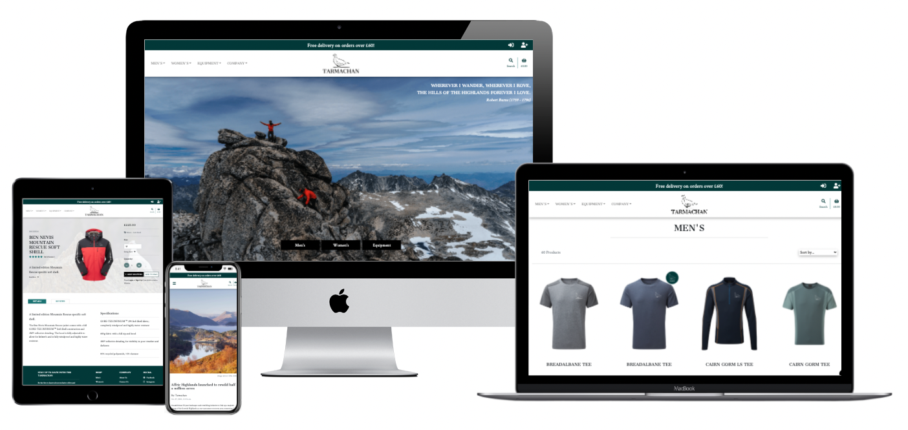
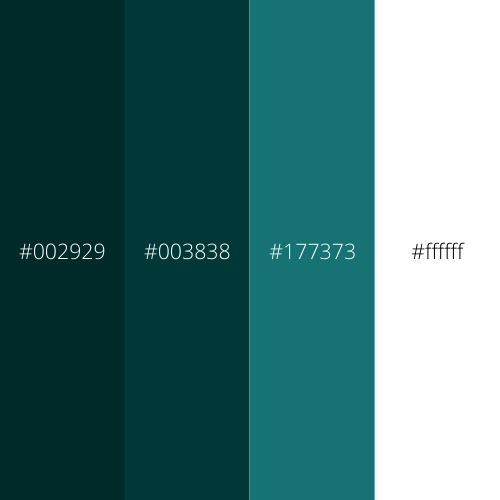
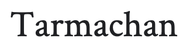
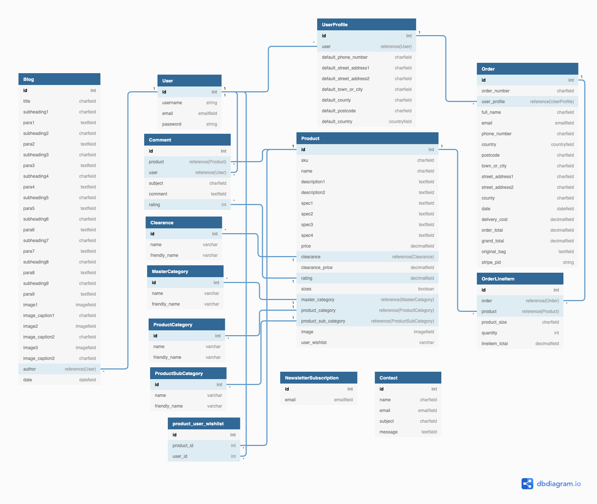

<h1 align="center">Tarmachan</h1>



View the repository in GitHub [here](https://github.com/Tawnygoody/Tarmachan)

View the live project [here](https://tarmachan.herokuapp.com/)

# Contents

1. [User Experience (UX)](#user-experience-(ux))
    - [Strategy](#strategy)
    - [Scope](#scope)
    - [Structure](#structure)
    - [Skeleton](#skeleton)
    - [Surface](#surface)
2. [Information Architecture](#information-architecture)
    - [Database](#database)
    - [Data Model](#data-model)
3. [Technologies Used](#technologies-used)
4. [Testing](#testing)
5. [Deployment](#deployment)
    - [Deployment to Heroku](#deployment-to-heroku)
    - [Storing Static Files with AWS](#storing-static-files-with-aws)
    - [Connecting Stripe to Heroku](#connecting-stripe-to-heroku)
6. [Credits](#credits)
7. [Acknowledgments](#acknowledgments)


# User Experience (UX)

## Strategy

### User Stories

#### Viewing & Navigation
1. As a first time user, I would like to instinctively know what the website is offering. 
2. As a first time user, I would like an intuitive navigation system to easily move around the site. 
3. As a first time user, I want to be able to view a range of products on the same page. 
4. As a first time user, I want to be able to view individual product detail. 
5. As a first time user, I want to be able to locate any special offers & deals to take advantage of any reduced prices. 
6. As a first time user, I would like to find out information about the company to see what the business can deliver. 
7. As a first time user, I want to be able to contact the business with any queries I may have. 

#### Registration & User Accounts
8. As a site user, I want to be able to sign up and register an account to make future purchases easier. 
9. As a site user, I want to be able to have access to a personal profile page where I'm able to see my order history and delivery details. 
10. As a site user, I want to be able to leave reviews on products to inform future site users about the business's products. 
11. As a site user, I want to be able to save items to a Wishlist for ease of purchase on future visits. 

#### Sorting & Searching
12. As a site user, I want to be able to see all the products that the company sells. 
13. As a site user, I want to be able to narrow down the products by categories and sub-categories. 
14. As a site user, I want to be able to sort products with various parameters. 
15. As a site user, I want to be able to search for products using keywords. 

#### Purchasing & Checkout
16. As a purchasing user, I want to be able to select product sizes (on products which have sizes) and select the quantity of product I wish to purchase. 
17. As a purchasing user, I want to be able to add items to a basket should I wish to make more than one purchase. 
18. As a purchasing user, I want to be notified when I've made changes to my basket and show an updated total price. 
19. As a purchasing user, I want to be able to update items in the basket by changing the quantity or removing the item from the basket entirely. 
20. As a purchasing user, I want to be able to checkout securely. 
21. As a purchasing user, I want to be able to view a confirmation page of my order and receive an email confirmation once the purchase is sucessful. 

#### Admin & Store Management
22. As a site owner, I want to be able to add, edit and remove products from the site easily. 
23. As a site owner, I want access to an admin section to view and manage orders. 
24. As a site owner, I want to be able to manage blog posts.. 
25. As a site owner, I want to be able to delete product reviews if they are unsuitable for the site. 
26. As a site owner, I want to be able to monitor contact messages that have been submitted by site user's and delete them once they have been responded to. 


## Scope

The key features of the website were developed based on the user stories

### For any site user: 
- Home page, with dramatic imagery and to quickly help user's understand the purpose of the site.
- Products Page, where users can view all the products, or products based on filtering criteria. 
- Product Detail Page, detailing information about the product. From here user's can read reviews from other customers and add products to their bags. 
- Shopping Bag page, where users can see what products have been added to their bag. 
- Checkout page, allowing users to purchase products. 
- Confirmation page, allowing users to see a confirmation of their order. 
- Blog Page, where users can look at all the blog posts that have been uploaded by the site owner. 
- Blog Detail Page, where users can find out more information about each blog post.
- Contact Page, where users can contact the company with any queries.
- Newsletter Subscriber, available on all pages where users can subscribe to the company newsletter. 
- Sign Up Page, where users can register to become a registered user. 
- About Us Page, where users can find out more about the company. 

### For registered users: 
All of the above plus: 
- Wishlist page, where users can store products in their wishlist. 
- Profile Page, where users can update their default delivery information allowing for ease at checkout. 
- Order History, from the profile page users can see the previous orders they have made. 
- Product Reviews, on the product detail page, users can leave a rating and a message about a product. 
- Log Out Page, where users can log out of their account. 

### For Site Admin:
All of the above plus: 
- Site management page, where admin users can add products, blog, and review contact messages from other users. 
- Add Product / Blog page, where admin can add products / blogs. 
- Edit Product / Blog Page, where admin can update products / blogs. 
- Product Reviews, admin can delete reviews from any user has left a review. 

## Structure

### Existing Features

#### Base Template

- Delivery Banner - The delivery banner contains information about free delivery and the free delivery threshold. It is fixed to the top of the screen to allow for ease of access and improved user navigation. The links take users to different parts of the site which are as follows:
    - Unregistered user: 
        - Login link
        - Register link
    - Registered user: 
        - Wishlist
        - Profile
        - Log Out
    - Superuser:
        - Site Administration
        - Wishlist
        - Profile
        - Log Out

- Navbar Desktop - The main navbar has a centralised Tarmachan Logo, which will take users to the home page. Main site links are aligned to the left of the logo. Each of these links will open a mega menu which spans the full width of the screen, again to help aid with navigation and to avoid large amount of scrolling with a regular dropdown. The search icon will drop down a search bar below the main nav, and the basket icon will take users to their shopping bag page. 

- Navbar Mobile - The mobile navbar has the same logo image, search and basket links. However rather than links to the left of the logo, a collapsible side nav can be triggered by a burger menu. Scrollable dropdowns allow for all the categories and subcategories to be selected. Also on smaller devices the delivery banner icons are removed and replaced with links within the burger menu. The height of the navbar is also reduced on smaller screen sizes to allow for more screen real estate. The navbar also sticks to the top of the screen on all devices to allow for ease of access to navigation. 

- Footer - The footer is split into different sections. The first column allows all users to sign up to the tarmachan newsletter by filling in the form with their email and clicking the submit button. There is also a link to the newsletter unsubscribe page which allows users to unsubcribe from the newsletter by filling in their email address. Confirmation emails will be issued to the user whenever they either sign up or unsubscribe from the newsletter. The second column contains navigational links to take the user to product pages for master categories, clearance and all products. The third column contains navigational links to take the user to pages about the company. This column will also show Logout and profile links depending on whether the user is logged in or not. The fourth column has links to social media sites. An additional logo will take the user back to the home page. 

- Toast Messages - Toast message boxes have been used throughout the site to display feedback to the user when they have made interactions with the site. These messages are colour coded to signify different message types: 
    - Green: Success
    - Yellow: Warning
    - Blue: Informative
    - Red: Errors

#### Home page

- Users are greated with a full height hero image and a quote which has relevance to the purpose of the site. There are 3 links available to the user which will take the users to products pages for the 3 master categories (Mens, Womens, Equipment). 
- There are featured cards for the 4 product categories for both mens and womens clothing. On desktop devices, when a user hovers over the card images, the Men's and Women's links will show. On mobile devices when a user clicks on one of the image cards the Men's and Women's links will show. 
- Large featured section for clearance products advertises the current marketing strategy. The image fulfills expectations as it takes the user to all products that are currently on sale. 
- Owl Carousel to display the 8 latest blog posts. Clicking the arrows will slide the blogs along by 1. Clicking the dots underneath will slide to the next set of blogs depending on screen size. The blogs will loop round constantly, and allows for touch sliding on smart devices. 

#### Products Page

- There is a product counter to display how many products are being displayed depending on filtering criteria. This will also display the search term that a user has entered in the search bar. 
- Sorting dropdown selector allows users to sort the products by various parameters. 
- I have kept the layout of the products page similar to that of the Boutique Ado walkthrough project by displaying 4 products in a row on extra large screens, 3 on large screens, 2 on medium and small devices and 1 on extra small screen sizes. 
- Each product card shows a the product image which when hovered over will show the product description and fade the product image. When this is clicked the user is directed to the product detail page, where they can view further details about the product or add it to their shopping bag. 
- Basic product information is displayed below the product image (product name, price, tag to the category, rating if applicable and the add to / remove from wishlist icon). I didnt want to overload the product card with too much detail. The information provided is enough to give the user an overview of the product. Products that are on sale will have a sale icon in the upper right corner of the product image to clearly identify which products are on sale to the user. 
- As the amount of products displaying on a page can be plentisome I have added a back to top button which resides in the bottom corner of the screen. I have deliberately made this quite minimalist so focus is not drawn away from the products. 

#### Product Detail Page

- On larger devices the first row is split into 3 sections:
    - Section 1: In this section there is some basic product information as well as links to take the users to the reviews section and product details section. Admin users are also able to edit and delete products using the icons featured in this section. This section will display below section 2 (product image) on smaller devices. 
    - Section 2: A centralised product image. On all screen sizes the product image has a site relevant background image behind it. This gives an almost 3D quality to the image and draws the user in. 
    - Section 3: This section is for purchasing. The user is able to select the quantity of the product they wish to purchase and select sizes (if the product has sizes). Products can be added to the bag by clicking the add to bag button. Users can return to an all products view by clicking the "Keep Shopping" button. Users are able to add and remove product to and from their wishlist by clicking the add to /remove from wishlist button. Users can also click the sizing chart link which will open a pop-out displaying relevant sizing information to the product. This can be closed using the cross in the pop up or by clicking elsewhere on the screen (larger devices only). This section will display below section 2 (product image) on smaller devices. 
- There are two tabs below the product information, image and purchasing options:
    - Product Details tab - This shows an extended description of the product along with product specifications. 
    - A reviews tab allows logged in user to submit reviews, and view any reviews that have been made by other users. 

#### Shopping Bag Page

- The shopping bag page can be broken into 5 parts for each product added to their bag: 
    - Product - which displays an image of the product the user has added to their bag. 
    - Product info - displays the name of the product, product sku and the product size (if applicable).
    - Price - displays the individual product price. 
    - Quantity - Users are able to update their order using the quantity selectors and the update button. Users can also remove that product from their shopping bag entirely by clicking the remove button. 
    - Subtotal - displays the subtotal for each product (product price * quantity).
- Underneath the products that are in the users bag, their is information for bag total, delivery and grand total. If a user does not meet the free delivery threshold a helpful message will be displayed to let them know what they need to spend in order to qualify for free deivery. 
- There is a button to take the users back to the all product page, and a "Secure Checkout" button to take the user to the checkout page. 
- If the user has no items in the shopping bag, a message is displayed to the user to let them know this and a button to take the user to the all products page is displayed. 

#### Checkout Page

- The Checkout page is split into two columns on larger devices, and 2 rows on smaller devices:
    - Order Summary - Gives a nice overview of each of the products that they are purchasing. Images are links which will take the user back to the product details page for that product. User's can also see a breakdown of the order total, delivery and grand total. 
    - Checkout Form - split into 3 sections:
        - Details - where users are invited to fill out their full name and email address. Email address will be auto populated if a user has logged in and saved this information to their profile. 
        - Delivery - Users can fill in where they wish their products to be delivered to. These fields will be auto populated if a user has logged in and saved this information to their profile. 
        - Payment - Users can enter their card details here in order to make payments and purchase their chosen products. 
- Below the checkout form users can click the "Adjust Bag" button to make adjustments to their shopping bag, or click the "Complete Order" button to make their purchases. Users are informed exactly how much they will be charged with a helpful message directly underneath the "Complete Order" button. 

#### Checkout Success Page 
- When a user successfully checks out a success toast will be shown to the user with the order number and a confirmation email will be sent to the user with some of the details of their order. 
- The checkout success page itself is split into two sections:
    - Order information which details the order info, delivery details and the billing info. 
    - Order Summary - Gives a nice overview of each of the products that they are purchasing. Images are links which will take the user back to the product details page for that product.
- More products link which will take the user back to the all products page encouraging the user to make more purchases. 

#### About Us Page
- Users can find out more about the company by clicking the about us link under the company dropdown (on larger devices), or within the burger menu. 
- Users are greeted with a hero image with the company mantra about the products. 
- The page is split into two sections - Our story where users can read about how the company was found and Our Philosophy where users can read about the companies efforts to use responsibly sourced materials. These are split by a site relevant parallax image. 

#### Contact Us Page
- Users can find different ways to contact the company on the contact page. Details for the company address, telephone, email and opening times can be found here. 
- The next section on this page allows users to contact the company using the form provided. Once the user submits a valid form a success message is displayed to the user to provide feedback and an email confirmation is sent to the user to let them know that we have received their query. 
- Contact messages can be located on the site administration page (for superusers only). 

#### Blog Page
- On the Blog page users can find snippets of all the blogs that have been uploaded to the site. The layout for this page is similar to that of the products in that on extra large devices 4 blog posts will show in a row, 3 on a large device, 2 on small and medium devices and 1 on extra small devices. 
- Each blog card has an image relevant to the blog, some information about the user who uploaded it and the date that it was uploaded. Blogs are ordered so that the most recent blogs display first. 
- Clicking anywhere on each blog card will take the user to the blog detail page for that blog. 

#### Blog Detail Page
- The blog detail page will appear differently for different blogs as not all fields are required to submit a blog. If all fields have been filled out it will display as follows: 
    - Full width hero image with an image caption underneath. 
    - Blog title, author and date the blog was uploaded followed by the first 3 paragraphs of which only the first paragraph is required. 
    - When a second image is added this will act as the parallax image between the 3rd and 4th paragraphs, and will have an image caption beneath. 
    - Paragraphs 4-6 will then display of which only paragraph 4 is required. 
    - When a third image is added this will act as a text break between paragraphs 6 and 7. An image caption will display below the image. 
    - Pragraphs 7-9 will then display of which only paragraph 7 is required. 
- I have deliberately made it that paragraphs 1, 4 and 7 are required so that there is text between each of the images. 
- On larger devices I have used an offset column so there is plenty of white space making text more readable and less condensed. 
- For regular users there is a link to take the user back to the blogs page. 
- For super users there are links to edit and delete the blog. 

#### Profile Page 
The user profile page is split into two parts: 
- Firstly users can update their default delivery information by filling in the form and clicking the update information button allowing for easier purchasing at checkout. 
- The second column has information about a users past orders. Users are able to click on the order number to take them to the checkout success page. Going to the confirmation page from the users profile, rather than a keep shopping link there is a link for the user to take them back to their profile. A message to inform the user that this is a past order confirmation is displayed to avoid confusion. 

#### User Wishlist Page
- This page will only be accessible to logged in users. If a user has not added any products to their wishlist then the user will be informed of this and a link to the all products page will be displayed. 
- When a user has added products to their wishlist they will be displayed here in the same format as the products page. Users will have all the same functionality as the products page from here. 

### Allauth features
- The sign up, register, password reset, email confirmation pages etc, have all been provided by Django allauth and formatted to suit the needs of the site. 

### Admin Features

- Admin will have access to additional features accross the site. Firsty admin members will have an additional icon in the delivery banner (on larger devices) or link in the burger menu (on smaller devices) to take the user to the site admin page. Here the admin user will have access to:
    - Add a product page link - Will take the admin user to the add product page. Here the user can fill in the form to add a product to the site. Once added the admin user will be taken to the product detail page for the product added. 
    - Add a blog link - Will take the admin user to the add blog page. Here the user can fill in the form to the add a blog to the site. Once added the admin user will be taken to the blog detail page for the blog added. 
    - Manage Contact Messages - Will take the admin user to the contact management page. Here admin users will be displyed with all the queries that have been submitted by other users. Admin users can view details of these messages by clicking on the name in the table. On both the contact management page and the contact detail page admin users are able to delete the messages once they have responded to the user. This will trigger a modal to make sure the user is happy to delete the message. 
- On the product page and product detail page admin users will have access to the edit and delete product icons. The edit icon will take the user to the edit product form, where they can make changes to a product (i.e put in the clearance category). The delete icon will trigger a modal to make sure the user wishes to delete the product and avoid accidental deletions. 

    

### Features left to implement

- Option for billing details and delivery details to be different. User's may wish to deliver items to a different address than their card is registered at. This could cause some issues with authentication. For the purposes of this site I'm happy to have this as a known limitation. 
- A welcome or discount offer for new customers, such as 20% off their first order, to encourage more registrations. 
- Social Media signup options. 
- Additional payment options such as apple pay or paypal for ease of purchasing. 


## Skeleton

Below you can find the links for my wireframes, showing how I would like the pages to be structured, and how the site will appear on different device sizes. 

The wireframes have been created using Balsamiq and show for Desktop, iPad and iPhone. 

- Home Page
    - [Desktop](documentation/wireframes/home-page/home-page-desktop-r.png)
    - [iPad](documentation/wireframes/home-page/home-page-ipad-r.png)
    - [iPhone](documentation/wireframes/home-page/home-page-iphone-r.png)
- All Products Page
    - [Desktop](documentation/wireframes/all-products-page/all-products-page-desktop-r.png)
    - [iPad](documentation/wireframes/all-products-page/all-products-page-ipad-r.png)
    - [iPhone](documentation/wireframes/all-products-page/all-products-page-iphone-r.png)
- View Product Page
    - [Desktop](documentation/wireframes/view-product-page/product-page-desktop-r.png)
    - [iPad](documentation/wireframes/view-product-page/product-page-ipad-r.png)
    - [iPhone](documentation/wireframes/view-product-page/product-page-iphone-r.png)
- Basket Page
    - [Desktop](documentation/wireframes/basket-page/basket-page-desktop-r.png)
    - [iPad](documentation/wireframes/basket-page/basket-page-ipad-r.png)
    - [iPhone](documentation/wireframes/basket-page/basket-page-iphone-r.png)
- Checkout Page
    - [Desktop](documentation/wireframes/checkout-page/checkout-page-desktop-r.png)
    - [iPad](documentation/wireframes/checkout-page/checkout-page-ipad-r.png)
    - [iPhone](documentation/wireframes/checkout-page/checkout-page-iphone-r.png)
- Confirmation Page
    - [Desktop](documentation/wireframes/confirmation-page/confirmation-page-desktop-r.png)
    - [iPad](documentation/wireframes/confirmation-page/confirmation-page-ipad-r.png)
    - [iPhone](documentation/wireframes/confirmation-page/confirmation-page-iphone-r.png)
- About Us Page
    - [Desktop](documentation/wireframes/about-us-page/about-us-desktop-r.png)
    - [iPad](documentation/wireframes/about-us-page/about-us-ipad-r.png)
    - [iPhone](documentation/wireframes/about-us-page/about-us-iphone-r.png)
- Contact Us Page
    - [Desktop](documentation/wireframes/contact-us-page/contact-us-desktop-r.png)
    - [iPad](documentation/wireframes/contact-us-page/contact-us-ipad-r.png)
    - [iPhone](documentation/wireframes/contact-us-page/contact-us-iphone-r.png)
- Blog Page
    - [Desktop](documentation/wireframes/blog-page/blog-page-desktop-r.png)
    - [iPad](documentation/wireframes/blog-page/blog-page-ipad-r.png)
    - [iPhone](documentation/wireframes/blog-page/blog-page-iphone-r.png)
- Blog Story Page
    - [Desktop](documentation/wireframes/blog-story-page/blog-story-desktop-r.png)
    - [iPad](documentation/wireframes/blog-story-page/blog-story-ipad-r.png)
    - [iPhone](documentation/wireframes/blog-story-page/blog-story-iphone-r.png)

## Surface

### Design

#### Colour Scheme

- Inspiration for my colour scheme has been taken from [Rab's website](https://rab.equipment/uk/mens/fleece-midlayer). I've decided to go for a slighter darker green to allow further contrast for the white text. As Tarmachan is an outdoors store this colour choice reflects the link between products sold and the Scottish countryside. 

- From there I have used complimentary shades of green to create a softer pallette highlighting different sections of the site. 

- I have decided to use a white background throughout the majority of the site. This is to keep the visual design clean and means the emphasis is on the products and imagery to bring vibrance to the site. This design follows that of similar Mountain equipment retailers such as [Rab](https://rab.equipment/uk/mens/fleece-midlayer), [North Face](https://www.thenorthface.co.uk/) and [Mountain Equipment](https://www.mountain-equipment.co.uk/). 



- (#002929) - Used for Delivery Banner and footer credits
- (#003838) - Used accross the site, primarily seen in the footer, on buttons, tooltips, color text etc.
- (#177373) - Used on product details tabs, icons and stars. 
- (#ffffff) - Used throughout the site as a background, and white text. 


#### Additional Colours Used

- (#0DCAF0) - Used for information toasts
- (#198754) - Used for success toasts
- (#FFC107) - Used for warning toasts
- (#DC3545) - Used for danger toasts and delete icons
- (#1b7945) - Used for discount text
- (#AAB7C4) - Used a placeholder text colour
- (#CCCCCC) - Used for unchecked stars
- (#B1B1B1) - Used for Box shadows

#### Typography

- I have used Cantata One as the logo font which has been used throughout the whole site. This was dictated when deciding what font to use on the products themselves. I wanted a font which was bold yet readable and looked uniform when it's formatted to be uppercase. The same font has therefore been used for headings, subheadings and some buttons. 


- I have used Crimson Text throughout the rest of the site for longer passages of text and paragraph use. Two font weights have been used to allow for emphasise at certain points on the site. This text is the same text used on the [Mountain Equipment](https://www.mountain-equipment.co.uk/) which was used as an inspiration for my site. 



#### Imagery

- Due to the nature of the products sold I have had to rely on other retailers products and modify them for use on my site. For the most part product images have come from [Mountain Equipment](https://www.mountain-equipment.co.uk/) and other online retailers (credited in the credits section).

- I have used a hero image on the home page to the give the site a dramatic appearance. Category images have been used for the featured products section on the home page to give a visual representation of what the companies products are intended for. Parallax images and product detail background images are in keeping with the company name. 

- Image credits can be found in the credit section of the README.

#### Icons

- Ive made use of icons in various section on the site. They have been used for navigation (on larger devices), social media links, wishlist, product tags and stars. All icons have been obtained from FontAwesome. 

# Information Architecture

## Database

- SQLite relational database management system (pre-installed with Django) has been used in development to store the data for this project. 
- PostgreSQL relational database management system has been used in production. 
- Note: The user model is provided by [Django Allauth](https://django-allauth.readthedocs.io/en/latest/index.html).

## Data Model

The following Entity-Relationship diagram shows the relationships between the models. 



### Blog App
- Blog Model
    - Contains the details of the blog post and is linked to the User model by the 'author' field. 

### Checkout App
- Order Model
    - Contains details of the of the user's orders, their delivery details, and the items they've order. It is linked to the UserProfile Model by the 'user_profile' field

- OrderLineItem Model
    - Contains details for the customer order, quantity and product total. It is linked to the Order Model by the 'order' field and the Product Model by the 'product field'.
### Products App
- MasterCategory
    - Contains Master Categories options for products. It is linked to the Product Model using a foreign key.

- ProductCategory
    - Contains Product Categories options for products. It is linked to the Product Model using a foreign key.

- ProductSubCategory
    - Contains Product Sub Categories options for products. It is linked to the Product Model using a foreign key.

- Clearance
    - Contains clearance options for products. Currently only 2 options, but further options could be added such as "Limited time offer" etc. It is linked to the Product Model using a foreign key.

- Product
    - Contains detailed product information for each product. 

- Comment
    - Contains the review information for each product. It is linked to the Product Model by the 'product' field and the User Model by the 'user' field. The rating field also updates the product rating each time a review is left. 
### Contact App
- NewsletterSubscription
    - Contains the email of users who have signed up to the newsletter
- Contact
    - Contains the details of users and their queries from the contact form. 
### Profiles App
- UserProfile
    - Contains the user's details for future orders. 
### Wishlist App
- user_wishlist
    - Although this is not a Model, I have built a one-to-one link between the User Model and Product Model, which creates a "link table" allowing user's to add products to their wishlist. 
### Django Allauth
- User
    - The User model is provided by default from Django Allauth and contains the username, email, and password for each user. 

### Fixtures

Fixtures were created for the following:
- MasterCategory
- ProductCategory
- ProductSubCategory
- Clearance
- Product

Using JSON files enabled the large amount of product and category data to be loaded easily into both the database in development and the database in production. 

# Technologies Used

## Languages Used

- [HTML](https://en.wikipedia.org/wiki/HTML5)
- [CSS](https://en.wikipedia.org/wiki/Cascading_Style_Sheets) 
- [JavaScript](https://en.wikipedia.org/wiki/JavaScript)
- [Python](https://www.python.org/)

## Libraries & Integrations
- [Django](https://www.djangoproject.com/)
    - This was the primary framework used for the project
- [Django Crispy Forms](https://django-crispy-forms.readthedocs.io/en/latest/)
    - This has been used to render the forms on the site.
- [Django Allauth](https://django-allauth.readthedocs.io/en/latest/index.html)
    - This has been used for user authentication on the site.
- [Django Countries](https://pypi.org/project/django-countries/)
    - Used to populate the countries select field on the order form and profile form
- [Coverage](https://pypi.org/project/coverage/)
    - Used to produce a testing report
- [Stripe](https://stripe.com/gb)
    - This has been used to handle payments.
- [Bootstrap](https://getbootstrap.com/)
    - Used as a framework for styling and to make the site responsive
- [Amazon Web Services](https://aws.amazon.com/)
    - Used to store all static files and images
- [SQLite](https://www.sqlite.org/index.html)
    - Database used in development
- [PostgreSQL](https://www.postgresql.org/)
    - Database used in production
- [Heroku](https://id.heroku.com/login)
    - Online Cloud Platform used to deploy the live site
- [Gunicorn](https://gunicorn.org/)
    - Used for deploying the project to Heroku
- [Fontawesome](https://fontawesome.com/)
    - Fontawesome has been used for icons across the website. 
- [Google Fonts](https://fonts.google.com/)
    - Google Fonts has been used to import "Cinzel" & "Montserrat" fonts used across the website. 
- [jQuery](https://jquery.com/)
    - Has been used to ease DOM manipulation. 
- [Balsamiq](https://balsamiq.com/)
    - This has been used to create the wireframes for the project. 
- [Canva](https://www.canva.com/)
    - Canva has been used to design the websites logo.
- [Photopea](https://www.photopea.com/)
    - This has been used to make changes to the product images.
- [Dbdiagram](https://dbdiagram.io/home) 
    - Used to create the database schema illustration.
- [Techsini](https://techsini.com/multi-mockup/)
    - Techsini has been used to generate mock images on different devices, and help with responsiveness.
- [Github](https://github.com/)
    - GitHub is used to store the project code after being pushed from Git.
- [Git](https://git-scm.com/) 
    - Git was used for version control by utilizing the Gitpod terminal to commit to Git and Push to GitHub.
- [Owl Carousel](https://owlcarousel2.github.io/OwlCarousel2/)
    - This has been used for the home page carousel for the blogs.

# Testing

All testing carried out on the website can be found in the following file: 

## [TESTING.md](TESTING.md)

# Deployment

## Deployment to Heroku

1. Create a Heroku app: 
    - Navigate to [Heroku](https://www.heroku.com/) and log in or sign up. 
    - From the dashboard click on new app and give the app a name and choose the region closest to you. 
    - On the resources tab provision a new postgres database by typing in heroku postgres.
2. To use Postgres dj_database_url & psycopg2 need to be installed. 
    - In the terminal type the following commands:
        - ```
            pip3 install dj_database_url
            ```
        - ```
            pip3 install psycopg2-binary
            ```
3. Make sure Heroku installs all our apps requirements when we deploy it using the following command in the terminal:
    - ```
        pip3 freeze > requirements.txt
        ```
4. To setup the websites new database navigate to settings.py import dj_database_url & comment out the default database configuration and replace the default database with a call to dj_database_url.parse. 
    - ```
        import dj_database_url
        DATABASES = {
            'default': dj_database_url.parse("your Postgres database URL in heroku")
        }
        ```
5. We need to run all migrations to the new Postgres database by entering the following in the terminal:
    - ```
        python3 manage.py migrate
        ```
6. We need to load the product data from the fixtures file into the new database: 
    - ```
        python3 manage.py loaddata master_categories
        python3 manage.py loaddata product_categories
        python3 manage.py loaddata product_sub_categories
        python3 manage.py loaddata clearance
        python3 manage.py loaddata products
        ```
7. A superuser was created with admin rights by typing the following into the terminal:
    - ```
        python3 manage.py createsuperuser
        ```
    - Follow the commands in the terminal for Username, email address and password
8. Add an if statement in settings.py for the default database, so that if the app is running on Heroku it connects to the Postgres database, otherwise the app connects to the SQLite3 database: 
    - ```
        if 'DATABASE_URL' in os.environ:
            DATABASES = {
                'default': dj_database_url.parse(os.environ.get('DATABASE_URL'))
            }
        else:
            DATABASES = {
                'default': {
                    'ENGINE': 'django.db.backends.sqlite3',
                    'NAME': BASE_DIR / 'db.sqlite3',
                }
            }
        ```
9. Gunicorn (Python WSGI HTTP Server for UNIX) will act as our webserver. To install it type the following into the terminal:
    - ```
        pip3 install gunicorn
        ```
    - Freeze that into the requirments file using: 
        - ```
            pip3 freeze > requirements.txt
            ```
10. Create a procfile in the root directory, to tell Heroku to create a web dyno, which will run gunicorn and serve the Django app. Type the following into the procfile: 
    - ```
        web: gunicorn tarmachan.wsgi:application
        ```
11. After logging in to Heroku at the command line we need to temporarily disable collectstatic so Heroku won't try to collect static files when deployed: 
    - ```
        heroku login -i
        heroku config:set DISABLE_COLLECTSTATIC=1 --app "app name goes here"
        ```
12. In settings.py we need to add the hostname of our Heroku app, and allow localhost so gitpod will still work too: 
    - ```
        ALLOWED_HOSTS = ['"app name goes here".herokuapp.com', 'localhost']
        ```
13. To deploy to Heroku type the following into the command line: 
    - ```
        heroku git:remote -a "app name goes here"
        git push heroku master
        ```
14. To set up automatic deployments when we push the code to github, in Heroku:
    - On the deploy tab set the app to connect to github by searching for the repository and clicking connect.
    - Click 'Enable Automatic Deploys" 
15. Using [Django Secret Key Generator](https://miniwebtool.com/django-secret-key-generator/) add the secret key to the config variables under the settings tab, which will act as the key for the Heroku app. 
    - We need to update the settings.py file so that the secret key is collected from the environment, and use an empty string as default: 
        - ```
            SECRET_KEY = os.environ.get('SECRET_KEY', '')
            ```
    - Additionally set the debug to be true only if there's a variable called "DEVELOPMENT" in the environment. 
        - ```
            DEBUG = 'DEVELOPMENT' in os.environ
            ```

## Storing static files with AWS

### Creating a New Bucket

1. Navigate to [Amazon AWS](https://aws.amazon.com/) and log in or sign up. 
2. From the AWS Management Console search for S3 in the services menu. 
3. Click the "create bucket" button and enter the following information:
    - Bucket Name: recommended to be the same name as the Heroku App. 
    - Region: enter the region that is closest to you.
    - Uncheck the "Block all public access" checkbox and acknowledge that the Bucket will be public.
    - Click the "Create bucket" button to create the bucket. 
4. Set some settings by clicking on the bucket that appears: 
    - Click the properties tab and turn on static website hosting, which gives a new endpoint to access the bucket from the internet. 
    - Click the properties tab to make 3 changes:
        1. Set the CORS configuration to: 
            - ```
                [
                    {
                        "AllowedHeaders": [
                            "Authorization"
                        ],
                        "AllowedMethods": [
                            "GET"
                        ],
                        "AllowedOrigins": [
                            "*"
                        ],
                        "ExposeHeaders": []
                    }
                ]
                ```
        2. Create a Security Policy for this Bucket using AWS S3 Bucket Policy generator located in the Bucket Policy tab:
            - Select the following options:
                - Policy Type: "S3 Bucket Policy"
                - Principal: Allow all principals using "*"
                - Actions: select "GetObject"
                - ARN: Copy the ARN from the permissions tab
            - Once the policy is generated copy the JSON document into the Bucket Policy editor. 
            - Before saving add a "/*" to the end of the resource key to allow access to all resources in this bucket.
            - Click the "Save" button. 
        3. Access the "Access Control List" tab, in the "Permissions" tab, and set the list objects permission for everyone under the "Public Access" section.

### Creating AWS Groups, Policies and Users

1. From the services menu search for IAM.
2. From the Access Management dropdown select 'User Groups'. 
    - Click the 'Create New Group" button:
        - Group name: Site relevant name. In this case "manage-tarmachan"
        - Click next through to create group. 
3. From the Access Management dropdown select 'Policies'
    - Click the 'Create Policy' button: 
        - Go to the JSOn tab and click 'import managed policy':
            - Search for S3 then select 'AmazonS3FullAccess' and click "import".
        - Get the ARN from the S3 bucket policy page and paste it in the "Resource" field as a list. Ensure two ARN's are added one for the bucket itself and another for all files and folders in the bucket (denoted by "/*" at the end of the string): 
            - ```
                {
                    "Version": "2012-10-17",
                    "Statement": [
                        {
                            "Effect": "Allow",
                            "Action": [
                                "s3:*",
                                "s3-object-lambda:*"
                            ],
                            "Resource": [
                                "arn:aws:s3:::tarmachan",
                                "arn:aws:s3:::tarmachan/*"
                            ]
                        }
                    ]
                }
                ```
        - Click the "Review Policy" button and give the policy a name and description and click the "create policy" button.
4. To attach the policy to the relevant group go back to the "User Groups" page:
    - Click the group you want to attach the policy to. 
    - Click "Attach Policy" 
    - Search for the policy that has been created and click the "Attach Policy" button.
5. From the Access Management dropdown click Users: 
    - Click the "Add User" button: 
        - Enter a user name and select the "Programmatic access' checkbox and select next: 
            - On the next page add the user to the group that was created and click through to create the user. 
        - Once the user is added download the CSV file which will contain the user's access key and secret access key, which will be used to authenticate the user from the Django App. 

### Connecting Django to S3

1. In order to connect the S3 bucket to django two new packages are required: 
    - ```
        pip3 install boto3
        ```
    - ```
        pip3 install django_storages
        ```
    - Add the new dependencies to the requirements with the following: 
        - ```
            pip3 freeze > requirements.txt
            ```
    - Add Django-storages to the list of INSTALLED_APPS in the settings.py file: 
        - ```
            INSTALLED_APPS = [
                'django.contrib.admin',
                'django.contrib.auth',
                'django.contrib.contenttypes',
                'django.contrib.sessions',
                'django.contrib.messages',
                'django.contrib.staticfiles',
                'django.contrib.sites',
                'allauth',
                'allauth.account',
                'allauth.socialaccount',
                'home',
                'products',
                'bag',
                'checkout',
                'blog',
                'profiles',
                'wishlist',
                'contact',

                # Other
                'crispy_forms',
                'storages',
            ]
            ```
2. To connect Django to S3 we need to update the setting.py file to tell Django which bucket it should be communicating with. We only want to this in the Heroku environment, so we can add an if statement to check if theres an environment variable called USE_AWS in the environment. 
    - ```
        if 'USE_AWS' in os.environ:
            AWS_STORAGE_BUCKET_NAME = 'tarmachan'
            AWS_S3_REGION_NAME = 'eu-west-1'
            AWS_ACCESS_KEY_ID = os.environ.get('AWS_ACCESS_KEY_ID')
            AWS_SECRET_ACCESS_KEY = os.environ.get('AWS_SECRET_ACCESS_KEY')
            AWS_S3_CUSTOM_DOMAIN = f'{AWS_STORAGE_BUCKET_NAME}.s3.amazonaws.com'
        ```
    - In Heroku we need to update the config variables: 
        - |  Key  |  Value  |
          |-----| ----- |
          | USE_AWS | True |
          | AWS_ACCESS_KEY_ID | Found in the CSV file when creating a user is IAM |
          | AWS_SECRET_ACCESS_KEY | Found in the CSV file when creating a user is IAM |
        - We need to remove the DISABLE_COLLECTSTATIC variable as django will now collect static files and upload them to S3. 
3. COLLECTSTATIC was renabled so that in production Django uses S3 to store static files and uploads new product and blog images to the bucket:
    - To do so create a new file in the root directory called 'custom_storages.py':
        - ```
            from django.conf import settings
            from storages.backends.s3boto3 import S3Boto3Storage


            class StaticStorage(S3Boto3Storage):
                location = settings.STATICFILES_LOCATION


            class MediaStorage(S3Boto3Storage):
                location = settings.MEDIAFILES_LOCATION
            ```
    - In settings.py these new storage classes were attached to new variables within the 'USE_AWS' block, so that in production static files are saved in a folder called 'static' and media files are saved in the folder called 'media'. URL's for media and static files have been overwritten using the custom domain and new locations:
        - ```
            if 'USE_AWS' in os.environ:
                # Bucket Config
                AWS_STORAGE_BUCKET_NAME = 'tarmachan'
                AWS_S3_REGION_NAME = 'eu-west-1'
                AWS_ACCESS_KEY_ID = os.environ.get('AWS_ACCESS_KEY_ID')
                AWS_SECRET_ACCESS_KEY = os.environ.get('AWS_SECRET_ACCESS_KEY')
                AWS_S3_CUSTOM_DOMAIN = f'{AWS_STORAGE_BUCKET_NAME}.s3.amazonaws.com'

                # Static and media files
                STATICFILES_STORAGE = 'custom_storages.StaticStorage'
                STATICFILES_LOCATION = 'static'
                DEFAULT_FILE_STORAGE = 'custom_storages.MediaStorage'
                MEDIAFILES_LOCATION = 'media'

                # Override static and media URL's in production
                STATIC_URL = f'https://{AWS_S3_CUSTOM_DOMAIN}/{STATICFILES_LOCATION}/'
                MEDIA_URL = f'https://{AWS_S3_CUSTOM_DOMAIN}/{MEDIAFILES_LOCATION}/'
            ```
    - To improve performance for our end users we can tell the browser that it's okay to cache static files for a long time since they don't change very often: 
        - Inside the 'USE_AWS' code block: 
            - ```
                # Cache Control
                AWS_S3_OBJECT_PARAMETERS = {
                    'Expires': 'Thu, 31 Dec 2099 20:00:00 GMT',
                    'CacheControl': 'max-age=94608000',
                }
                ```
4. In the S3 bucket create a new folder called 'media'. 
    - Inside the media folder click upload -> add files and select all the product, blog and site images:
        - Select 'Grant public read access to these objects' before clicking through to 'upload'. 

## Connecting Stripe to Heroku

1. Log in to [Stripe](https://stripe.com/gb) 
2. From the dashboard go to "developer" and select API Keys. Copy the publishable and secret keys and add them as config variables in Heroku:
    - |  Key  |  Value  |
      |-----| ----- |
      | STRIPE_PUBLIC_KEY | From Stripe |
      | STRIPE_SECRET_KEY | From Stripe |
3. Add a new webhook endpoint by clicking webhooks in the developers menu on stripe and clicking the "add endpoint" button: 
    - Add the endpoint as the URL for the heroku app followed by "checkout/wh/", and set up to receive all events: 
        - ```
            https://tarmachan.herokuapp.com/checkout/wh/
            ```
4. Copy the signing secret for the new webhook and add it to the heroku config variables: 
    - |  Key  |  Value  |
      |-----| ----- |
      | STRIPE_WH_SECRET | From Stripe |