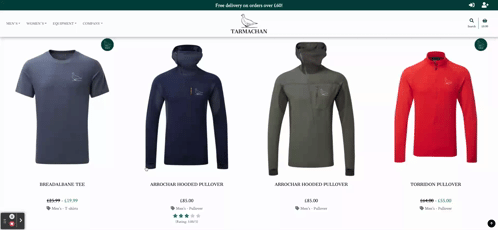
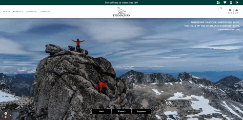
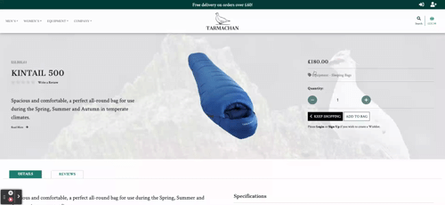
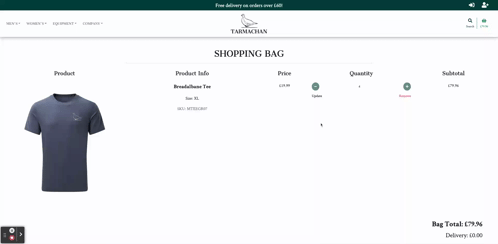
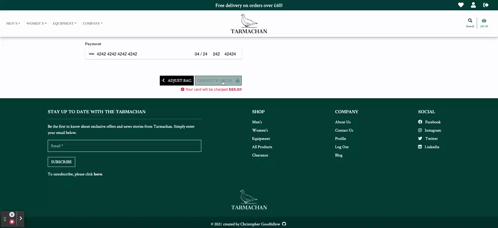
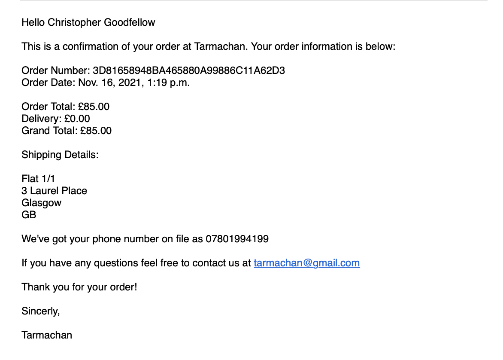
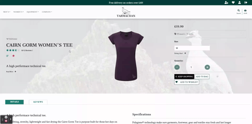

# Testing

# Contents
- [Testing User Stories](#testing-user-stories)
    - [Viewing & Navigation](#viewing-and-navigation)
    - [Registration & User Accounts](#registration-and-user-accounts)
    - [Sorting & Searching](#sorting-and-searching)
    - [Purchasing & Checkout](#purchasing-and-checkout)
    - [Admin & Store Management](#admin-and-store-management)
- [Code Validation](#code-validation)
- [Browser Compatibility](#browser-compatibility)
- [Functionality Testing](#functionality-testing)
    - [Navigation](#navigation)
    - [Home Page](#home-page)
    - [Registration & Log In](#registration-and-log-in)
    - [Adding A Recipe](#adding-a-recipe)
    - [Editing A Recipe](#editing-a-recipe)
    - [Deleting A Recipe](#deleting-a-recipe)
    - [User Profile](#user-profile)
    - [Save Recipe to Profile](#save-recipe-to-profile)
    - [Recipes Search & View](#recipes-search-and-view)
    - [Recipe Page](#recipe-page)
    - [Dashboard](#dashboard)
- [Responsive Design](#responsive-design)
- [Security Testing](#security-testing)
- [Unit Testing](#unit-testing)
- [Solved Bugs](#solved-bugs)
- [Known Issues](#known-issues)
- [Lighthouse](#lighthouse)

# Testing User Stories

## Viewing & Navigation
1. As a first time user, I would like to instinctively know what the website is offering. 
    - The home page has numerous references to being a mountain equipment store through imagery.
    - Call to action buttons give an overview of what kind of products are likely to be available. 
    - Clearance section shows that there is currently a sale on the site's products. 

    

2. As a first time user, I would like an intuitive navigation system to easily move around the site. 
    - Icons in the delivery banner (large devices only) allow easy access to Log In and Sign Up functionality. These are tooltipped to provide further guidance to the user. Icons vary depending on whether a user is logged in and if the user is a superuser. 
    - There are 4 links on the left side of the logo, which opens up mega menus for user's to filter products and find out more information about the company. 
    - Search icon opens up search menu and a basket icon allows access to the shopping bag. 
    - The navigation is fixed to the top of the screen so is always accessible for users. 
    - Additional navigation links are available in the footer. 
    - At various points on the site users can redirect to return to the products / blogs page at the click of a button. 
    - On mobile devices a burger menu opens up a menu where user's can direct to various pages of the site. Scrollable dropdowns are available to allow for filtering. 

    

3. As a first time user, I want to be able to view a range of products on the same page. 
    - The products page shows all the products available on the site. The mega menu options will narrow this down dependant on various categories. 
    - As nearly all user's may not be necessarily interested in all products gievn that their are products for different genders, there is no all products link in the mega menu, however this can be accessed from the footer. 

    

4. As a first time user, I want to be able to view individual product detail. 
    - On the products page users can see the product image, name, price and rating (if a product has a rating). When hovering over an image an overlay with the product description can be seen.
    - When the user clicks a product from the products page they are taken to the product detail page. Here the user can see a variety information about the product, including further descriptions, specifications and reviews. 

    

5. As a first time user, I want to be able to locate any special offers & deals to take advantage of any reduced prices. 
    - From the mega menu there are links for clearance items in each of the three master categories. 
    - In the footer there is a link for all products in clearance. 
    - On the home page there is large clearance image, inviting users to take advantage of products on offer. 
    - On the products page, products which are in clearance are clearly identifiable by the sale logo in the upper right corner of the product card, and by the clearance price displayed. 

    

6. As a first time user, I would like to find out information about the company to see what the business can deliver. 
    - User's can go to the company tab and look at the about us section which has a breif overview of the company and its philosophy. This can also be accessed in the footer. 

    

7. As a first time user, I want to be able to contact the business with any queries I may have.
    - User's are able to find a contact page for the comany on the company tab. Additional a link can be found in the footer. 
    - The contact page has company details, opening times and a contact form. Customers are notified by email when a successful contact request has been made. 

    

## Registration & User Accounts
8. As a site user, I want to be able to sign up and register an account to make future purchases easier. 
    - One larger devices users can click on the register icon in the upper right corner of the screen which is tooltipped to aid users. 
    - Alternatively users can sign up via the sign up link in the footer, which takes them to the register page. 
    - On mobile devices users can sign up via the link in the burger menu, or again in the footer. 
    - Login links can be found in the same places as the register links but will redirect the users to the login page. 
    - Once user's have registered they are notified a confirmation email has been sent to their email address. Upon opening this link usr's can confirm their email address and login. 

    

9. As a site user, I want to be able to have access to a personal profile page where I'm able to see my order history and delivery details. 
    - Registered users have access to their profile page by clicking the icon in the upper right corner which is tool tipped to aid users. On smaller screen users can access their profile from the burger menu. Users also have access to their profile by clicking the link in the footer. 
    - On the profile page user's can update their delivery information. 
    - Users can also click on previous orders which will take them to their confirmation page for that order, and a message will show to let the user know they are looking at a past order. 

    

10. As a site user, I want to be able to leave reviews on products to inform future site users about the business's products. 
    - When a user is logged in they have access to fill in a form on the product detail page under the reviews tab. 
    - Users must provide a subject, message and rating to inform other users. 
    - Users will be able to delete any comments they have made, should they wish. 
    - Once a user has left a review it will update the product rating, and create an average rating based on all the users reviews. 

    

11. As a site user, I want to be able to save items to a Wishlist for ease of purchase on future visits. 
    - When a user is logged in they will have access to their wishlist. This can be accessed by the icon in the upper right corner on large devices or via the burger menu on smaller devices. 
    - On the product pages, each product card will have a heart outline to signify that this product is not currently in the users wishlist. If a product is already in the user's wishlist the heart will have a colour fill. This is tooltipped to aid the user on larger devices. Clicking the heart will either add or remove a product from the users wishlist. 
    - Simarlarly there is a button on the product detail page which allows users to add or remove a product from a users wishlist. 

    

## Sorting & Searching
12. As a site user, I want to be able to see all the products that the company sells. 
    - User's are able to find an all products link in the footer. 
    - As the site has a range of products across 3 main categories I have decided against an all products link in the main nav as its unlikely that users will wish to see all products. 
    - Various links across the site will take the users to an all products page. 

    

13. As a site user, I want to be able to narrow down the products by categories and sub-categories. 
    - The mega menu nav bar allows user's to sort products via master categories(mens, womens, equipment), product categories(tops, jackets, legwear etc), and product sub categories(t-shirts, pullover, fleece etc). 

    

14. As a site user, I want to be able to sort products with various parameters. 
    - Users are able to sort products on the products page using the sort by dropdown selector. Users have the option to sort the products by Price: high to low or low to high, Rating: high to low or low to high, Name: A-Z or Z-A. 
    - Note: sorting by rating low to high: products which have not yet received a rating will appear at the top. 

    

15. As a site user, I want to be able to search for products using keywords.  
    - Users are able to to click the search icon which will open the the search bar allowing users to search for products using keywords. 

    

## Purchasing & Checkout
16. As a purchasing user, I want to be able to select product sizes (on products which have sizes) and select the quantity of product I wish to purchase. 
    - Users are able to select the site of product using the dropdown provided on products which have sizes. User's can also open a sizing chart to correctly identify what size they require. 
    - Users are able to select the quantity of items that they wish using the selectors and can choose between 1-99. 

    

17. As a purchasing user, I want to be able to add items to a basket should I wish to make more than one purchase. 
    - Users can add items to their bag from the product detail page, allowing them to make more than one purchase

    

18. As a purchasing user, I want to be notified when I've made changes to my basket and show an updated total price. 
    - When a user adds an item to the basket a success toast provides feedback that a product has been added, and gives a summary of the items in the users bag. This message dissapears when a user closes the toast or redirect to another page.
    - Any time a user adds a product to their bag, the basket icon in the navbar changes colour and updates the price based on whats in the basket (plus delivery if not over the delivery threshold). 

    

19. As a purchasing user, I want to be able to update items in the basket by changing the quantity or removing the item from the basket entirely. 
    - User's can update and remove products from their bag, on the shopping bag page, which can be accessed by clicking the basket in the navbar. 
    - User's will be notified whenever they update or remove an item from their shopping bag. 

    

20. As a purchasing user, I want to be able to checkout securely. 
    - User's are able to checkout by clicking the secure checkout button on the shopping bag page. 
    - On the checkout page users can fill in the form. Required fields are indicated with a star in the placeholder. 
    - Once the form is valid and the user has clicked the complete order button the checkout process is complete. 

    

21. As a purchasing user, I want to be able to view a confirmation page of my order and receive an email confirmation once the purchase is sucessful.
    - Once a user has completed the checkout process, they will be shown a confirmation page with details of their order. 
    - Users will also shown a message letting them know that a confirmation email has been sent to their email address. 
    - Registered users can find past confirmation orders in their profile. 

    

    

## Admin & Store Management
22. As a site owner, I want to be able to add, edit and remove products from the site easily. 
    - Superuser's will have access to a site management page. Access to this can be found by clicking the icon in the upper right corner which is tooltipped to aid users (larger devices only). On smaller devices the site management page can be accessed via the burger menu. 
    - From here superusers can add products to the site, by clicking the add product icon and filling in the form. Once the add product button is submitted the user will be redirected to the product detail page for the product they have just added. 
    - From the product detail page superusers can edit and delete products by clicking on the icons for these options. 
    - Superusers can also edit and delete products from the products page directly. 

    

23. As a site owner, I want access to an admin section to view and manage orders. 
    - The admin user has access to the django admin section where they can manage orders. 

    

24. As a site owner, I want to be able to manage blog posts. 
    - Superusers are able to add blogs from the site management page.
    - Once a blog is added the user is redirected to the blog detail page. From this page superusers, are able to edit and delete blogs. These buttons will not be available to regular users. 

    

25. As a site owner, I want to be able to delete product reviews if they are unsuitable for the site. 
    - Superusers are able to delete any comments that have been left by other users, by clicking the trash icon on product reviews. 

    

26. As a site owner, I want to be able to monitor contact messages that have been submitted by site user's and delete them once they have been responded to. 
    - Superusers are able to manage contact messages on the site management page by cliking the manage contacts icon. From here superusers can monitor messages that have been sent and delete them once the messages have been responded to. 

    

# Code Validation
# Browser Compatibility
# Functionality Testing
# Responsive Design
# Security Testing
# Unit Testing
# Solved Bugs

|  #  |  Bug  |  Description  |  Fix  |
|:---:|------| ---------------- |----------------|
| 01 | Deleting products on prodcut page | When trying to delete a product on the products page. When I opened to modal to delete a product it wouldn't retrieve the correct product ID in order to delete it. It was only the first product that would get deleted. | I tried to move the delete modal inside the for loop within the template, however this did not resolve the issue. I found a solution on stack overflow which grabbed the data id and url and applied them to the correctly to the delete modal with some javadscript. |
| 02 | Parallax Container on smaller devices | I originally found the css code for creating a parallax image on w3schools. However when testing the device on smaller devices (ipad and iphone) the parallax image was zoomed in and not was not in a fixed position as it is on desktop devices. | After some research I found the issue was stemming from the "background-attachment: fixed;" property. This does not appear to be compatible on IOS devices. I found a solution on stack overflow which was to set the background image for the whole page and give it a lower z-index, so that the parallax image only appears in the parallax container, and then set the remaining page background to white.  |
| 03 | Product review form on smaller devices |  |  |

# Known Issues
|  #  |  Bug  |  Description  |
|:---:|------| ---------------- |
| 01 | Scrolling with Parallax Images | |

# Lighthouse
