# Testing

# Contents
- [Testing User Stories](#testing-user-stories)
    - [Viewing & Navigation](#viewing-and-navigation)
    - [Registration & User Accounts](#registration-and-user-accounts)
    - [Sorting & Searching](#sorting-and-searching)
    - [Purchasing & Checkout](#purchasing-and-checkout)
    - [Admin & Store Management](#admin-and-store-management)
- [Code Validation](#code-validation)
- [Browser Compatibility](#browser-compatibility)
- [Functionality Testing](#functionality-testing)
    - [Navigation](#navigation)
    - [Home Page](#home-page)
    - [Products Page](#products-page)
    - [Product Detail Page](#product-detail-page)
    - [Shopping Bag Page](#shopping-bag-page)
    - [Checkout Page](#checkout-page)
    - [Checkout Success Page](#checkout-success-page)
    - [About Us Page](#about-us-page)
    - [Contact Page](#contact-page)
    - [Blog Page](#blog-page)
    - [Blog Detail Page](#blog-detail-page)
    - [Wishlist Page](#wishlist-page)
    - [Profile Page](#profile-page)
    - [Site Management Page](#site-management-page)
    - [Add Product Page](#add-product-page)
    - [Edit Product Page](#edit-product-page)
    - [Add Blog Page](#add-blog-page)
    - [Edit Blog Page](#edit-blog-page)
    - [Contact Management Page](#contact-management-page)
    - [Contact Detail Page](#contact-detail-page)
    - [Newsletter Unsubscribe Page](#newsletter-unsubscribe-page)
    - [Log In Page](#log-in-page)
    - [Log Out Page](#log-out-page)
    - [Register Page](#register-page)
- [Stripe Payments](#stripe-payments)
- [Responsive Design](#responsive-design)
- [Security Testing](#security-testing)
- [Unit Testing](#unit-testing)
- [Solved Bugs](#solved-bugs)
- [Known Issues](#known-issues)
- [Lighthouse](#lighthouse)

# Testing User Stories

## Viewing & Navigation
1. As a first time user, I would like to instinctively know what the website is offering. 
    - The home page has numerous references to being a mountain equipment store through imagery.
    - Call to action buttons give an overview of what kind of products are likely to be available. 
    - Clearance section shows that there is currently a sale on the site's products. 

    [User Story 1](documentation/testing/testing_user_stories/user_story1.gif)

2. As a first time user, I would like an intuitive navigation system to easily move around the site. 
    - Icons in the delivery banner (large devices only) allow easy access to Log In and Sign Up functionality. These are tooltipped to provide further guidance to the user. Icons vary depending on whether a user is logged in and if the user is a superuser. 
    - There are 4 links on the left side of the logo, which opens up mega menus for user's to filter products and find out more information about the company. 
    - Search icon opens up search menu and a basket icon allows access to the shopping bag. 
    - The navigation is fixed to the top of the screen so is always accessible for users. 
    - Additional navigation links are available in the footer. 
    - At various points on the site users can redirect to return to the products / blogs page at the click of a button. 
    - On mobile devices a burger menu opens up a menu where user's can direct to various pages of the site. Scrollable dropdowns are available to allow for filtering. 

    [User Story 2](documentation/testing/testing_user_stories/user_story2.gif)

3. As a first time user, I want to be able to view a range of products on the same page. 
    - The products page shows all the products available on the site. The mega menu options will narrow this down dependant on various categories. 
    - As nearly all user's may not be necessarily interested in all products gievn that their are products for different genders, there is no all products link in the mega menu, however this can be accessed from the footer. 

    [User Story 3](documentation/testing/testing_user_stories/user_story3.gif)


4. As a first time user, I want to be able to view individual product detail. 
    - On the products page users can see the product image, name, price and rating (if a product has a rating). When hovering over an image an overlay with the product description can be seen.
    - When the user clicks a product from the products page they are taken to the product detail page. Here the user can see a variety information about the product, including further descriptions, specifications and reviews. 

    [User Story 4](documentation/testing/testing_user_stories/user_story4.gif)

5. As a first time user, I want to be able to locate any special offers & deals to take advantage of any reduced prices. 
    - From the mega menu there are links for clearance items in each of the three master categories. 
    - In the footer there is a link for all products in clearance. 
    - On the home page there is large clearance image, inviting users to take advantage of products on offer. 
    - On the products page, products which are in clearance are clearly identifiable by the sale logo in the upper right corner of the product card, and by the clearance price displayed. 

    [User Story 5](documentation/testing/testing_user_stories/user_story5.gif)

6. As a first time user, I would like to find out information about the company to see what the business can deliver. 
    - User's can go to the company tab and look at the about us section which has a breif overview of the company and its philosophy. This can also be accessed in the footer. 

    [User Story 6](documentation/testing/testing_user_stories/user_story6.gif)

7. As a first time user, I want to be able to contact the business with any queries I may have.
    - User's are able to find a contact page for the comany on the company tab. Additional a link can be found in the footer. 
    - The contact page has company details, opening times and a contact form. Customers are notified by email when a successful contact request has been made. 

    [User Story 7](documentation/testing/testing_user_stories/user_story7.gif)

## Registration & User Accounts
8. As a site user, I want to be able to sign up and register an account to make future purchases easier. 
    - One larger devices users can click on the register icon in the upper right corner of the screen which is tooltipped to aid users. 
    - Alternatively users can sign up via the sign up link in the footer, which takes them to the register page. 
    - On mobile devices users can sign up via the link in the burger menu, or again in the footer. 
    - Login links can be found in the same places as the register links but will redirect the users to the login page. 
    - Once user's have registered they are notified a confirmation email has been sent to their email address. Upon opening this link usr's can confirm their email address and login. 

    [User Story 8](documentation/testing/testing_user_stories/user_story8.gif)

9. As a site user, I want to be able to have access to a personal profile page where I'm able to see my order history and delivery details. 
    - Registered users have access to their profile page by clicking the icon in the upper right corner which is tool tipped to aid users. On smaller screen users can access their profile from the burger menu. Users also have access to their profile by clicking the link in the footer. 
    - On the profile page user's can update their delivery information. 
    - Users can also click on previous orders which will take them to their confirmation page for that order, and a message will show to let the user know they are looking at a past order. 

    [User Story 9](documentation/testing/testing_user_stories/user_story9.gif)

10. As a site user, I want to be able to leave reviews on products to inform future site users about the business's products. 
    - When a user is logged in they have access to fill in a form on the product detail page under the reviews tab. 
    - Users must provide a subject, message and rating to inform other users. 
    - Users will be able to delete any comments they have made, should they wish. 
    - Once a user has left a review it will update the product rating, and create an average rating based on all the users reviews. 

    [User Story 10](documentation/testing/testing_user_stories/user_story10.gif)

11. As a site user, I want to be able to save items to a Wishlist for ease of purchase on future visits. 
    - When a user is logged in they will have access to their wishlist. This can be accessed by the icon in the upper right corner on large devices or via the burger menu on smaller devices. 
    - On the product pages, each product card will have a heart outline to signify that this product is not currently in the users wishlist. If a product is already in the user's wishlist the heart will have a colour fill. This is tooltipped to aid the user on larger devices. Clicking the heart will either add or remove a product from the users wishlist. 
    - Simarlarly there is a button on the product detail page which allows users to add or remove a product from a users wishlist. 

    [User Story 11](documentation/testing/testing_user_stories/user_story11.gif)

## Sorting & Searching
12. As a site user, I want to be able to see all the products that the company sells. 
    - User's are able to find an all products link in the footer. 
    - As the site has a range of products across 3 main categories I have decided against an all products link in the main nav as its unlikely that users will wish to see all products. 
    - Various links across the site will take the users to an all products page. 

    [User Story 12](documentation/testing/testing_user_stories/user_story12.gif)

13. As a site user, I want to be able to narrow down the products by categories and sub-categories. 
    - The mega menu nav bar allows user's to sort products via master categories(mens, womens, equipment), product categories(tops, jackets, legwear etc), and product sub categories(t-shirts, pullover, fleece etc). 

    [User Story 13](documentation/testing/testing_user_stories/user_story13.gif)

14. As a site user, I want to be able to sort products with various parameters. 
    - Users are able to sort products on the products page using the sort by dropdown selector. Users have the option to sort the products by Price: high to low or low to high, Rating: high to low or low to high, Name: A-Z or Z-A. 
    - Note: sorting by rating low to high: products which have not yet received a rating will appear at the top. 

    [User Story 14](documentation/testing/testing_user_stories/user_story14.gif)

15. As a site user, I want to be able to search for products using keywords.  
    - Users are able to to click the search icon which will open the the search bar allowing users to search for products using keywords. 

    [User Story 15](documentation/testing/testing_user_stories/user_story15.gif)

## Purchasing & Checkout
16. As a purchasing user, I want to be able to select product sizes (on products which have sizes) and select the quantity of product I wish to purchase. 
    - Users are able to select the site of product using the dropdown provided on products which have sizes. User's can also open a sizing chart to correctly identify what size they require. 
    - Users are able to select the quantity of items that they wish using the selectors and can choose between 1-99. 

    [User Story 16](documentation/testing/testing_user_stories/user_story16.gif)

17. As a purchasing user, I want to be able to add items to a basket should I wish to make more than one purchase. 
    - Users can add items to their bag from the product detail page, allowing them to make more than one purchase

    [User Story 17](documentation/testing/testing_user_stories/user_story17.gif)

18. As a purchasing user, I want to be notified when I've made changes to my basket and show an updated total price. 
    - When a user adds an item to the basket a success toast provides feedback that a product has been added, and gives a summary of the items in the users bag. This message dissapears when a user closes the toast or redirect to another page.
    - Any time a user adds a product to their bag, the basket icon in the navbar changes colour and updates the price based on whats in the basket (plus delivery if not over the delivery threshold). 

    [User Story 17](documentation/testing/testing_user_stories/user_story17.gif)

19. As a purchasing user, I want to be able to update items in the basket by changing the quantity or removing the item from the basket entirely. 
    - User's can update and remove products from their bag, on the shopping bag page, which can be accessed by clicking the basket in the navbar. 
    - User's will be notified whenever they update or remove an item from their shopping bag. 

    [User Story 19](documentation/testing/testing_user_stories/user_story19.gif)

20. As a purchasing user, I want to be able to checkout securely. 
    - User's are able to checkout by clicking the secure checkout button on the shopping bag page. 
    - On the checkout page users can fill in the form. Required fields are indicated with a star in the placeholder. 
    - Once the form is valid and the user has clicked the complete order button the checkout process is complete. 

    [User Story 20](documentation/testing/testing_user_stories/user_story20.gif)

21. As a purchasing user, I want to be able to view a confirmation page of my order and receive an email confirmation once the purchase is sucessful.
    - Once a user has completed the checkout process, they will be shown a confirmation page with details of their order. 
    - Users will also shown a message letting them know that a confirmation email has been sent to their email address. 
    - Registered users can find past confirmation orders in their profile. 

    [User Story 21](documentation/testing/testing_user_stories/user_story21.gif)

    [User Story 21 email](documentation/testing/testing_user_stories/user_story21-email.png)

## Admin & Store Management
22. As a site owner, I want to be able to add, edit and remove products from the site easily. 
    - Superuser's will have access to a site management page. Access to this can be found by clicking the icon in the upper right corner which is tooltipped to aid users (larger devices only). On smaller devices the site management page can be accessed via the burger menu. 
    - From here superusers can add products to the site, by clicking the add product icon and filling in the form. Once the add product button is submitted the user will be redirected to the product detail page for the product they have just added. 
    - From the product detail page superusers can edit and delete products by clicking on the icons for these options. 
    - Superusers can also edit and delete products from the products page directly. 

    [User Story 22](documentation/testing/testing_user_stories/user_story22.gif)


23. As a site owner, I want access to an admin section to view and manage orders. 
    - The admin user has access to the django admin section where they can manage orders. 

    [User Story 23](documentation/testing/testing_user_stories/user_story23.gif)

24. As a site owner, I want to be able to manage blog posts. 
    - Superusers are able to add blogs from the site management page.
    - Once a blog is added the user is redirected to the blog detail page. From this page superusers, are able to edit and delete blogs. These buttons will not be available to regular users. 

    [User Story 24](documentation/testing/testing_user_stories/user_story24.gif)

25. As a site owner, I want to be able to delete product reviews if they are unsuitable for the site. 
    - Superusers are able to delete any comments that have been left by other users, by clicking the trash icon on product reviews. 

    [User Story 25](documentation/testing/testing_user_stories/user_story25.gif)

26. As a site owner, I want to be able to monitor contact messages that have been submitted by site user's and delete them once they have been responded to. 
    - Superusers are able to manage contact messages on the site management page by cliking the manage contacts icon. From here superusers can monitor messages that have been sent and delete them once the messages have been responded to. 

    [User Story 26](documentation/testing/testing_user_stories/user_story26.gif)


# Code Validation

## HTML

The sites html has been tested using [W3C Markup Validator](https://validator.w3.org/). By getting the source code for each page ("ctrl + option + u" for mac) and copying into the validator I was able to identify any errors/warnings for each page. Results are outlined below:

|  Test  |  Result  |  Noting Points  |
|-----| ----- |---------------|
| index.html | No Errors: [View](documentation/testing/code_validation/html/index_html.png) | N/A |
| products.html | No Errors: [View](documentation/testing/code_validation/html/products_html.png) | N/A |
| product_detail.html | No Errors: [View](documentation/testing/code_validation/html/product_detail_html.png) | N/A |
| bag.html | Duplicate ID error & warnings: [View](documentation/testing/code_validation/html/bag_html.png) | This is a result of the increment and decrement quantity selectors. As one or another is hidden depending on screen sizes this is justified use |
| checkout.html | Duplicate ID error & warnings: [View](documentation/testing/code_validation/html/checkout_html.png) | This is a result of duplicate ID's being rendered by crispy forms for the email field on the checkout form and the email field in the footer for the newsletter subscription. This is noted in the Known Issues section. | 
| checkout_success.html | No Errors: [View](documentation/testing/code_validation/html/checkout_success_html.png) | N/A |
| about_us.html | No Errors: [View](documentation/testing/code_validation/html/about_us_html.png) | N/A |
| contact_us.html | Duplicate ID error & warnings: [View](documentation/testing/code_validation/html/contact_us_html.png) | This is a result of duplicate ID's being rendered by crispy forms for the email field on the contact form and the email field in the footer for the newsletter subscription. This is noted in the Known Issues section. | 
| blog.html | No Errors: [View](documentation/testing/code_validation/html/blog_html.png) | N/A |
| blog_detail.html | No Errors: [View](documentation/testing/code_validation/html/blog_detail_html.png) | N/A |
| wishlist.html | No Errors: [View](documentation/testing/code_validation/html/products_html.png) | N/A |
| profile.html | No Errors: [View](documentation/testing/code_validation/html/profile_html.png) | N/A |
| add_product.html | No Errors: [View](documentation/testing/code_validation/html/add_product_html.png) | N/A |
| edit_product.html | No Errors: [View](documentation/testing/code_validation/html/edit_product_html.png) | N/A |
| add_blog.html | No Errors: [View](documentation/testing/code_validation/html/add_blog_html.png) | N/A |
| edit_blog.html | No Errors: [View](documentation/testing/code_validation/html/edit_blog_html.png) | N/A |
| contact_management.html | No Errors: [View](documentation/testing/code_validation/html/contact_management_html.png) | N/A |
| contact_detail.html | No Errors: [View](documentation/testing/code_validation/html/contact_detail_html.png) | N/A |
| newsletter_unsubscribe | Duplicate ID error & warnings: [View](documentation/testing/code_validation/html/newsletter_unsubscribe_html.png) | This is a result of duplicate ID's being rendered by crispy forms for the email field on the newsletter unsubscribe form and the email field in the footer for the newsletter subscription. This is noted in the Known Issues section. |
| login.html | No Errors: [View](documentation/testing/code_validation/html/log_in_html.png) | N/A |
| logout.html | No Errors: [View](documentation/testing/code_validation/html/log_out_html.png) | N/A |
| sign_up.html | Duplicate ID error & warnings: [View](documentation/testing/code_validation/html/sign_up_html.png) | This is a result of duplicate ID's being rendered by crispy forms for the email field on the sign up form and the email field in the footer for the newsletter subscription. This is noted in the Known Issues section. |

## CSS

The sites CSS files have been validated using [W3C CSS Validator](https://jigsaw.w3.org/css-validator/). Results are outlined below

|  Test  |  Result  |
|-----| ----- |
| base.css | No errors: [View](documentation/testing/code_validation/css/base_css.png) |
| owl.carousel.min.css | No errors: [View](documentation/testing/code_validation/css/owl_carousel_css.png) |
| own.theme.default.min.css | No errors: [View](documentation/testing/code_validation/css/owl_carousel_theme_css.png) |
| profile.css | No errors: [View](documentation/testing/code_validation/css/profile_css.png) |
| checkout.css | No errors: [View](documentation/testing/code_validation/css/checkout_css.png) |

## Javascript

The sites JS files and scripts have been validated using [JSHint](https://jshint.com/). Results are outlined below

|  Test  |  Result  | 
|-----| ----- |
| blog_images.js | No errors: [View](documentation/testing/code_validation/js/blog_images_js.png)| 
| scroll.js | No errors: [View](documentation/testing/code_validation/js/scroll_js.png)| 
| bag.html script | No errors: [View](documentation/testing/code_validation/js/bag_html_script.png) | 
| stripe_elements.js | No errors: [View](documentation/testing/code_validation/js/stripe_elements_js.png) | 
| contact_management.html script | No Errors: [View](documentation/testing/code_validation/js/contact_management_html_script.png) | 
| index.html script | No errors: [View](documentation/testing/code_validation/js/index_html_script.png) |
| countryfield.js | No errors: [View](documentation/testing/code_validation/js/countryfield_js.png) |
| base.html script | No errors: [View](documentation/testing/code_validation/js/base_html_script.png) |
| products.html script 1 | No errors: [View](documentation/testing/code_validation/js/products_html_script1.png) |
| products.html script 2 | No errors: [View](documentation/testing/code_validation/js/products_html_script2.png) |
| product_detail.html script | No errors: [View](documentation/testing/code_validation/js/product_detail_html_script.png) |
| add_product.html script | No errors: [View](documentation/testing/code_validation/js/add_product_html_script.png) |
| edit_product.html script | No errors: [View](documentation/testing/code_validation/js/edit_product_html_script.png) |
| quantity_input_script.html | No errors: [View](documentation/testing/code_validation/js/quantity_input_script.png) |

## Python

The sites Python files have been validated using [PEP8 online](http://pep8online.com/). Results are outlined below:

### Bag

|  Test  |  Result  | 
|-----| ----- |
| contexts.py | No Error: [View](documentation/testing/code_validation/python/bag/bag_contexts_py.png) |
| urls.py | No Error: [View](documentation/testing/code_validation/python/bag/bag_urls_py.png) |
| views.py | No Error: [View](documentation/testing/code_validation/python/bag/bag_views_py.png) |
| bag_tools.py | No Error: [View](documentation/testing/code_validation/python/bag/bag_tools_py.png) |
| test_views.py | No Error: [View](documentation/testing/code_validation/python/bag/bag_test_views_py.png) |

### Blog

|  Test  |  Result  | 
|-----| ----- |
| admin.py | No Error: [View](documentation/testing/code_validation/python/blog/blog_admin_py.png) |
| forms.py | No Error: [View](documentation/testing/code_validation/python/blog/blog_forms_py.png) |
| models.py | No Error: [View](documentation/testing/code_validation/python/blog/blog_models_py.png) |
| urls.py | No Error: [View](documentation/testing/code_validation/python/blog/blog_urls_py.png) | 
| views.py | No Error: [View](documentation/testing/code_validation/python/blog/blog_views_py.png) |
| widgets.py | No Error: [View](documentation/testing/code_validation/python/blog/blog_widgets_py.png) |
| test_forms.py | No Error: [View](documentation/testing/code_validation/python/blog/blog_test_forms_py.png) |
| test_models.py | No Error: [View](documentation/testing/code_validation/python/blog/blog_test_models_py.png) |
| test_views.py | No Error: [View](documentation/testing/code_validation/python/blog/blog_test_views_py.png) |

### Checkout

|  Test  |  Result  |  Noting Points  |
|-----| ----- |---------------|
| admin.py | No Error: [View](documentation/testing/code_validation/python/checkout/checkout_admin_py.png) | N/A |
| apps.py | No Error: [View](documentation/testing/code_validation/python/checkout/checkout_apps_py.png) | N/A |
| forms.py | No Error: [View](documentation/testing/code_validation/python/checkout/checkout_forms_py.png) | N/A |
| models.py | No Error: [View](documentation/testing/code_validation/python/checkout/checkout_models_py.png) | N/A |
| signals.py | No Error: [View](documentation/testing/code_validation/python/checkout/checkout_signals_py.png) | N/A |
| urls.py | No Error: [View](documentation/testing/code_validation/python/checkout/checkout_urls_py.png) | N/A |
| views.py | 1 Error - Line too long [View](documentation/testing/code_validation/python/checkout/checkout_views_py.png) | There is a line too long for a "for" block of code. I've tried correcting this myself by using brackets in certain parts of the code but it is creating further errors, and tried using online Python Beautifiers but there is no recomendations for this issue. This isn't having an impact on the functionality of the code therefore accepting as a known limitation |
| webhook_handler.py | 1 Error - Line too long [View](documentation/testing/code_validation/python/checkout/checkout_webhook_handler_py.png) | There is a line too long for a "for" block of code. I've tried correcting this myself by using brackets in certain parts of the code but it is creating further errors, and tried using online Python Beautifiers but there is no recomendations for this issue. This isn't having an impact on the functionality of the code therefore accepting as a known limitation |
| webhooks.py | No Error: [View](documentation/testing/code_validation/python/checkout/checkout_webhooks_py.png) | N/A |
| test_forms.py | No Error: [View](documentation/testing/code_validation/python/checkout/checkout_test_forms_py.png) | N/A |
| test_models.py | No Error: [View](documentation/testing/code_validation/python/checkout/checkout_test_models_py.png) | N/A |
| test_views.py | No Error: [View](documentation/testing/code_validation/python/checkout/checkout_test_views_py.png) | N/A |

### Contact

|  Test  |  Result  | 
|-----| ----- |
| admin.py | No Error: [View](documentation/testing/code_validation/python/contact/contact_admin_py.png) |
| contexts.py | No Error: [View](documentation/testing/code_validation/python/contact/contact_contexts_py.png) |
| forms.py | No Error: [View](documentation/testing/code_validation/python/contact/contact_forms_py.png) |
| models.py | No Error: [View](documentation/testing/code_validation/python/contact/contact_models_py.png) |
| urls.py | No Error: [View](documentation/testing/code_validation/python/contact/contact_urls_py.png) |
| views.py | No Error: [View](documentation/testing/code_validation/python/contact/contact_views_py.png) |
| test_forms.py | No Error: [View](documentation/testing/code_validation/python/contact/contact_test_forms_py.png) |
| test_models.py | No Error: [View](documentation/testing/code_validation/python/contact/contact_test_models_py.png) |
| test_views.py | No Error: [View](documentation/testing/code_validation/python/contact/contact_test_views_py.png) |

### Home

|  Test  |  Result  |
|-----| ----- |
| urls.py | No Error: [View](documentation/testing/code_validation/python/home/home_urls_py.png) |
| views.py | No Error: [View](documentation/testing/code_validation/python/home/home_views_py.png) |
| test_views.py | No Error: [View](documentation/testing/code_validation/python/home/home_test_views_py.png) |

### Products

|  Test  |  Result  |
|-----| ----- |
| admin.py | No Error: [View](documentation/testing/code_validation/python/products/products_admin_py.png) |
| forms.py | No Error: [View](documentation/testing/code_validation/python/products/products_forms_py.png) |
| models.py | No Error: [View](documentation/testing/code_validation/python/products/products_models_py.png) |
| urls.py | No Error: [View](documentation/testing/code_validation/python/products/products_urls_py.png) |
| views.py | No Error: [View](documentation/testing/code_validation/python/products/products_views_py.png) |
| widgets.py | No Error: [View](documentation/testing/code_validation/python/products/products_widgets_py.png) |
| test_forms.py | No Error: [View](documentation/testing/code_validation/python/products/products_test_forms_py.png) |
| test_models.py | No Error: [View](documentation/testing/code_validation/python/products/products_test_models_py.png) |
| test_views.py | No Error: [View](documentation/testing/code_validation/python/products/products_test_views_py.png) |

### Profiles

|  Test  |  Result  |
|-----| ----- |
| forms.py | No Error: [View](documentation/testing/code_validation/python/profiles/profiles_forms_py.png) |
| models.py | No Error: [View](documentation/testing/code_validation/python/profiles/profiles_models_py.png) |
| urls.py | No Error: [View](documentation/testing/code_validation/python/profiles/profiles_urls_py.png) |
| views.py | No Error: [View](documentation/testing/code_validation/python/profiles/profiles_views_py.png) |
| test_forms.py | No Error: [View](documentation/testing/code_validation/python/profiles/profiles_test_forms_py.png) |
| test_models.py | No Error: [View](documentation/testing/code_validation/python/profiles/profiles_test_models_py.png) |
| test_views.py | No Error: [View](documentation/testing/code_validation/python/profiles/profiles_test_views_py.png) |

### Wishlist
|  Test  |  Result  |
|-----| ----- |
| urls.py | No Error: [View](documentation/testing/code_validation/python/wishlist/wishlist_urls_py.png) |
| views.py | No Error: [View](documentation/testing/code_validation/python/wishlist/wishlist_views_py.png) |
| test_views.py | No Error: [View](documentation/testing/code_validation/python/wishlist/wishlist_test_views_py.png) |


# Browser Compatibility

The site has been tested on different web browsers on different devices. 

The 3 main devices used for testing are: 
- Macbook Air
- Ipad 8th Generation
- Iphone 8

The site has been manually tested on these devices with Google Chrome & Safari with no issues. 

[Testing Bot](https://testingbot.com/) has been used to test the site on the following browsers:
- Opera
- Firefox
- Microsoft Edge

Other than some slight styling differences with the browsers default behaviour to select boxes and dropdowns, there are no differences and the site works well on all browsers tested.

# Functionality Testing

Funcionality testing has been carried out on all browsers listed in the browser compatibility section. 

## Navigation

|  Test  |  Action  |  Expected Result  |  Pass  |
|:---:|------| ---------------- |:---:|
| 01 | Logo in Navbar | Takes the user to the home page | ✓ |
| 02 | Men's Link | Opens the mega menu for men's products. All subsequent product links working | ✓ |
| 03 | Women's Link | Opens the mega menu for women's products. All subsequent product links working | ✓ |
| 04 | Equipment Link | Opens the mega menu for equipment products. All subsequent product links working | ✓ |
| 05 | Company Link | Opens the mega menu for company links (on larger screens only). All subsequent product links working | ✓ |
| 06 | Search Icon | Opens the search bar underneath the main nav | ✓ |
| 07 | Basket Icon | Takes the user to their shopping bag page | ✓ |
| 08 | Log Out Icon (When User logged in & large screens) | On hover tooltip shows describing the link and takes the user to the log out page | ✓ |
| 09 | Profile Icon (When User logged in & large screens) | On hover tooltip shows describing the link and takes the user to their profile page | ✓ |
| 09 | Wishlist Icon (When User logged in & large screens) | On hover tooltip shows describing the link and takes the user to their wishlist | ✓ |
| 10 | Site Management (When Super User logged in & large screens) | On hover tooltip shows describing the link and takes the user to the site management page | ✓ |
| 11 | Burger menu | Burger menu opens and all the corresponding links work in accordance with what type of user is logged in | ✓ |
| 12 | Shop Links in footer | Takes the user to the products page with the correct filters applied | ✓ |
| 13 | Company Links | Takes the user to the correct company pages and shows the relevant links when a user is logged in / not logged in. | ✓ |
| 14 | Facebook Icon | Opens facebook in a new tab | ✓ |
| 15 | Instagram Icon | Opens Instagram in a new tab | ✓ |
| 16 | Twitter Icon | Opens Twitter in a new tab | ✓ |
| 17 | Linkedin Icon | Opens Linkedin in a new tab | ✓ |
| 18 | Footer Logo | Takes the user to the home page | ✓ |
| 19 | Github icon | Opens the github repository for the site in a new tab | ✓ |
| 20 | Newsletter Subscriber | Ensure when a user enters a valid email a success messages is displayed confirming the user of their subscription and an email is sent to the user to confirm their subscription. | ✓ |
| 21 | Newsletter Unsubscribe link | Takes the user newsletter unsubscribe page | ✓ |
| 22 | Sticky top Navbar | Ensure when the user scrolls down the page that the delivery banner and the main navbar stick to the top of the page | ✓ |

## Home Page
|  Test  |  Action  |  Expected Result  |  Pass  |
|:---:|------| ---------------- |:---:|
| 01 | Men's Hero Image Link | Takes the user to products page, with all products in the "mens" master category  | ✓ |
| 02 | Women's Hero Image Link | Takes the user to products page, with all products in the "womens" master category  | ✓ |
| 03 | Equipment Hero Image Link | Takes the user to products page, with all products in the "equipment" master category  | ✓ |
| 04 | Hovering over featured products | Scales in the images and transitions in the links for the mens and womens of that product category | ✓ |
| 05 | Mens and womens featured product links | Takes the user to the products page, with the correct filters applied for master category and product category | ✓ |
| 06 | Clearance Image | Takes the user to products page, with all products in the clearance category  | ✓ |
| 07 | Owl carousel | Next and Previous arrows slide the carousel along by 1. Dots slide the carousel to the next set of blogs. Touch sliding enabled on smart devices | ✓ |
| 08 | Blog Cards | Clicking the blog cards takes the user to the blog detail for that card. Hovering on the cards scales the cards in | ✓ |

## Products Page

|  Test  |  Action  |  Expected Result  |  Pass  |
|:---:|------| ---------------- |:---:|
| 01 | Product Count | Product Count updates in accordance with how many products are being displayed and search term displays if a user has enter a search query  | ✓ |
| 02 | Sort By Dropdown | Sort by dropdown displays all the options available and sorts the products in accordance with the selection | ✓ |
| 03 | Product Image Hover | Hovering over the product image will fade the image and show the product description for that product | ✓ (Large devices only) |
| 04 | Product Cards | Ensure Product image, title, price and tag are showing for each product | ✓ |
| 05 | Clearance products | Ensure products that are currently in the clearance are displaying the clearance icon image and that the clearance price is rendered and original price is scored through | ✓ |
| 06 | Products with Ratings | Ensure products with ratings that stars appear and are filled in accordance with their rating and the actual rating displays below | ✓ |
| 07 | Wishlist Icon (When user logged in) | Ensure when a user is logged in the Wishlist icon is displayed | ✓ |
| 08 | In Wishlist Icon | Ensure when a product is in the users wishlist the wishlist icon has a colour fill | ✓ |
| 09 | Not in Wishlist Icon | Ensure when a product is not in the users wishlist only the outline shows for the wishlist icon | ✓ |
| 10 | Edit Product Icon (When Super User is logged in) | Ensure the edit icon displays and when clicked takes the superuser to the edit product form | ✓ |
| 11 | Delete Product Icon (When Super User is logged in) | Ensure the delete icon displays and when clicked opens the delete product model | ✓ |
| 12 | Delete Product Modal (Cancel Button) | Ensure that when the cancel button is clicked it closes the modal and no further action is taken to delete the product | ✓ |
| 13 | Delete Product Modal (Delete Button) | Ensure that when the delete product button is clicked it deletes the products and no longer displays on the site | ✓ |
| 14 | Product Tags Link | Ensure when the tags link is clicked it takes the user to the products page for that master category and product sub category | ✓ |

## Product Detail Page 

|  Test  |  Action  |  Expected Result  |  Pass  |
|:---:|------| ---------------- |:---:|
| 01 | Product Rating link | Ensure when the product rating is clicked it opens the reviews tab and closes the details tab and takes the user to the reviews section | ✓ |
| 02 | Read More link | Ensure when the read more link is clicked the user is taken to the details section. If the reviews tab is open ensure clicking read more closes the product reviews section and open the details section. | ✓ |
| 03 | Products tag link | Ensure when the products tag link is clicked is takes the user to the products page with the master category and product sub category filters applied | ✓ |
| 04 | Size Selector | Ensure the size selector box is functioning properly so users are able to pick different sizes for products | ✓ |
| 05 | Sizing Chart | Ensure when the sizing chart link is clicked the relevant sizing chart transitions in. Ensure clicking the cross or clicking elsewhere on the product details page (larger devices only) closes the sizing chart. | ✓ |
| 06 | Quantity Selectors | Ensure users are able to increase the quantity by clicking the plus and minus quantity selectors. Ensure that the quantity cannot be clicked lower than 1 or higher than 99. | ✓ |
| 07 | Keep Shopping link | Ensure the link takes the user back to the all products page | | ✓ |
| 08 | Add to Bag link | Ensure when a product is added to the bag that a toast to confirm this to user is displayed, and the basket icon in the navbar is updated to reflect the price of the items in the basket plus delivery (if applicable) | ✓ |
| 09 | Log In and Sign Up Links (When not logged in) | Ensure the log in and sign up links are displayed when a user is not logged in and the user is redirected to the relevant page. Check under add to bag button and in reviews section | ✓ |
| 10 | Wishlist Links (When user logged in) | Ensure the add to wishlist link adds a product to the users wishlist and a toast message displays to confirm this and vice vera when removing products from the wishlist | ✓ |
| 11 | Details and Reviews tabs | Ensure when the reviews tab is clicked the details section is hidden and vice versa | ✓ |
| 12 | No product Reviews | Ensure when there are no reviews on a product a message to show this is displayed in the product reviews section | ✓ |
| 13 | Product Reviews | Ensure product reviews are rendering correctly with the latest reviews at the top | ✓ |
| 14 | Delete Comment (Superuser and reviewer only) | Ensure that the delete comment icon displays when the review user or superuser is logged in. When clicked ensure the delete comment modal displays to avoid unwanted deletion. When delete comment button is clicked ensure the comment is deleted and the rating is adjusted. | ✓ |
| 15 | Review Form | Ensure that all fields are filled in, in order to successfully submit the form | ✓ |
| 16 | Product Rating | Ensure when a new review is added the product rating updates to reflect the average from all the reviews left | ✓ |

## Shopping Bag Page

|  Test  |  Action  |  Expected Result  |  Pass  |
|:---:|------| ---------------- |:---:|
| 01 | Product Items | Ensure each product is displaying in a separate row and their are different rows for the same product but with different sizes | ✓ |
| 02 | Quantity Selectors | Ensure users are able to increase the quantity by clicking the plus and minus quantity selectors. Ensure that the quantity cannot be clicked lower than 1 or higher than 99. | ✓ |
| 03 | Update Link | Ensure clicking the update link updates the quantity for that product only | ✓ |
| 04 | Remove Link | Ensure clicking the remove link removes the product from the bag entirely | ✓ |
| 05 | Totals | Ensure that the subtotal of each product, bag total, and grand total are updated whenever a product is updated to reflect whats in the bag | ✓ |
| 06 | Delivery Cost | Ensure the delivery cost displays if a user does not meet the minimum delivery threshold | ✓ |
| 07 | Keep Shopping Button | Ensure whne the keep shopping button is clicked the user is redirected to the all products page | ✓ |
| 08 | Secure Checkout Button | Ensure when the secure checkout button is clikced the user is taken to the checkout page | ✓ |
| 09 | No items in bag | Ensure when their are no items in the users shopping bag, that this message is displayed to the user and the keep shopping link is displayed | ✓ |

## Checkout Page

|  Test  |  Action  |  Expected Result  |  Pass  |
|:---:|------| ---------------- |:---:|
| 01 | Order Summary | Ensure order summary information renders correctly with a row for each product. Ensure the totals match the contents of the bag | ✓ |
| 02 | Checkout Form | Ensure the form cannot be submitted without all the required fields been filled | ✓ |
| 03 | Pre-populated fields | Ensure when a user is logged in and they have saved their delivery details to their profile the corresponding fields are pre-populated | ✓ |
| 04 | Save details checkbox | Ensure when the delivery information checkbox is checked that the user's profile is updated with this information once the form is submitted | ✓ |
| 05 | Log In and Sign Up Links (When not logged in) | Ensure the log in and sign up links are displayed when a user is not logged in and the user is redirected to the relevant page. | ✓ |
| 06 | Card errors | Ensure the card errors message displays for any card numbers that are invalid / insufficient funds etc | ✓ |
| 07 | Adjust Bag button | Ensure the adjust bag button redirects the user back to their shopping bag | ✓ |
| 08 | Card Charge notification | Ensure the notification to let the user know how much their card will be charged is displaying at that the total matches the total in the order summary section | ✓ |
| 09 | Complete Order button | Ensure when the complete order button is clicked the loading overlay shows before being redirected to the checkout success page | ✓ |

## Checkout Success Page

|  Test  |  Action  |  Expected Result  |  Pass  |
|:---:|------| ---------------- |:---:|
| 01 | Toast success message | Ensure when redirected to the checkout success page a confirmation toast with the order number and a message to let the user know a confirmation email has been sent to their email is displayed | ✓ |
| 02 | Confirmation Email | Ensure the user receives a confirmation email to the address that they entered on the checkout page | ✓ |
| 03 | Order Summary | Ensure order summary information renders correctly with a row for each product. | ✓ |
| 04 | Order Info | Ensure the order info matches the information entered on the checkout form and that the totals are correct | ✓ |
| 05 | Keep Shopping link | Ensure the keep shopping link redirects the user to the all products page | ✓ |
| 06 | Back to profile link (when looking at past orders) | Ensure the back to profile link displays when users are looking at past orders from their profile, and when clicked it redirect the user back to their profile | ✓ |

## About Us Page

|  Test  |  Action  |  Expected Result  |  Pass  |
|:---:|------| ---------------- |:---:|
| 01 | Correct Rendering | Ensure the about us page is rendering correctly on all device sizes | ✓ |

## Contact Us Page

|  Test  |  Action  |  Expected Result  |  Pass  |
|:---:|------| ---------------- |:---:|
| 01 | Form Validation | Ensure that the form cannot be submitted without all the required fields being completed | ✓ |
| 02 | Cancel Button | Ensure the cancel button redirects the user back to the home page | ✓ |
| 03 | Submitting Form | Ensure when a valid form is submitted that the form is cleared and a success message displays to inform the user that their message has been sent | ✓ |
| 04 | Confirmation Email | Ensure that a confirmation email is sent to the user when a form is submitted detailing their message | ✓ |
| 05 | Admin View (Superuser Only) | Ensure that when a contact message is sent it displays on the contact management page for admin users to respond to | ✓ |

## Blog Page

|  Test  |  Action  |  Expected Result  |  Pass  |
|:---:|------| ---------------- |:---:|
| 01 | Blog Cards | Ensure that the blog cards are rendering correctly, are ordered with the latest blog post appearing first and with the right information and that only the first the lines of the first paragraph are displaying on the blog cards | ✓ |
| 02 | Blog Cards hovering (desktop only) | Ensure when the blog cards are hovered over the scale in. | ✓ |
| 03 | Blog Cards | Ensure that clicking anywhere on the blog card redirect the user to the blog detail for that blog | ✓ |

## Blog Detail Page

|  Test  |  Action  |  Expected Result  |  Pass  |
|:---:|------| ---------------- |:---:|
| 01 | Page Layout | Ensure the page layout renders correctly when different inputs have been filled | ✓ |
| 02 | All Blogs Link | Ensure the all blogs link takes the user back to the main blog page | ✓ |
| 03 | Edit Blog Link (When superuser is logged in) | Ensure the edit blog link takes the superuser to the edit blog page | ✓ |
| 04 | Delete Blog Link | Ensure that the delete blog link opens the delete blog modal. Ensure cancelling closes the delete and clicking delete, removes the blog from the database | ✓ |

## Wishlist Page

|  Test  |  Action  |  Expected Result  |  Pass  |
|:---:|------| ---------------- |:---:|
| 01 | No Products in Wishlist | Ensure when a user hasn't added any products to their wishlist that this is displayed to the user and an all products link takes the user back to the all products page | ✓ |
| 02 | Product Cards | Ensure product cards are displaying as they would of the products page, once an item is added to the wishlist | ✓ |
| 03 | Remove from wishlist | Ensure when the remove from wishlist link is clicked that the product is removed from the user wishlist and the user is notified with a toast message | ✓ |
| 04 | Product Detail Link | Ensure clicking the product image takes the user to the product detail page | ✓ |

## Profile Page 

|  Test  |  Action  |  Expected Result  |  Pass  |
|:---:|------| ---------------- |:---:|
| 01 | Delivery Information Form | Ensure that the users delivery information is displaying in the relevant fields if theyu have previously made an order and clicked the save to profile checkbox | ✓ |
| 02 | Update Information | Ensure that updating the delivery information and clicking the update information button will save those changes to the user's profile and a success message displays to confirm this to the user | ✓ |
| 03 | Previous orders | Ensure previous order information displays in the order history column and displays with the latest order at the top | ✓ |
| 04 | Previous order confirmation | Ensure clicking the order number takes the user to the checkout success page for that order | ✓ |

## Site Management Page

|  Test  |  Action  |  Expected Result  |  Pass  |
|:---:|------| ---------------- |:---:|
| 01 | Add Product Link (Accessible to superusers only) | Ensure clicking the add product link takes the user to the add product page  | ✓ |
| 02 | Add Blog Link (Accessible to superusers only) | Ensure clicking the add blog link takes the user to the add blog page  | ✓ |
| 03 | Manage Contact Messages (Accessible to superusers only) | Ensure clicking the manage contact messages takes the user to the contact management page  | ✓ |

## Add Product Page

|  Test  |  Action  |  Expected Result  |  Pass  |
|:---:|------| ---------------- |:---:|
| 01 | Form Rendering | Ensure all the form fields are rendering correctly  | ✓ |
| 02 | Required Fields | Ensure trying to add a product without the required fields doesn't add a product to the database and the user is informed of which fields are required | ✓ |
| 03 | Dropdown Fields | Ensure all the categories/clearance/sizes options are appearing in the dropdown fields | ✓ |
| 04 | Image Selector | Ensure clicking the select image link allows the user to upload an image from their device, and a message displays to the user what the image will be set too | ✓ |
| 05 | Cancel Link | Ensure clicking the cancel button takes the user back to the products page | ✓ |
| 06 | Add Product Link | Ensure clicking the add product link takes the user to the product detail page for the new product and the information is rendering correctly | ✓ |

## Edit Product Page

|  Test  |  Action  |  Expected Result  |  Pass  |
|:---:|------| ---------------- |:---:|
| 01 | Form Fields | Ensure the form fields are pre-populated with the product information stored in the database | ✓ |
| 02 | Cancel Link | Ensure clicking the cancel button takes the user back to the products page | ✓ |
| 03 | Update Product Link | Ensure when the user updates any of the product information and clicks the update product link that this is displayed on the product detail page when the user is redirected | ✓ |

## Add Blog Page

|  Test  |  Action  |  Expected Result  |  Pass  |
|:---:|------| ---------------- |:---:|
| 01 | Form Rendering | Ensure all the form fields are rendering correctly  | ✓ |
| 02 | Required Fields | Ensure trying to add a blog without the required fields doesn't add a blog to the database and the user is informed of which fields are required | ✓ |
| 03 | Image Selectors | Ensure clicking the select image buttons allows the user to upload an image from their device, and a message displays to the user what the image will be set too | ✓ |
| 04 | Cancel Link | Ensure clicking the cancel button takes the user back to the blogs page | ✓ |
| 05 | Add Blog Link | Ensure clicking the add blog button takes the user to the blog detail page for the new blog and the information is rendering correctly | ✓ |

## Edit Blog Page

|  Test  |  Action  |  Expected Result  |  Pass  |
|:---:|------| ---------------- |:---:|
| 01 | Form Fields | Ensure the form fields are pre-populated with the blog information stored in the database | ✓ |
| 02 | Cancel Link | Ensure clicking the cancel button takes the user back to the blogs page | ✓ |
| 03 | Update Blog Link | Ensure when the user updates any of the blog information and clicks the update blog button that this is displayed on the blog detail page when the user is redirected | ✓ |

## Contact Management Page 

|  Test  |  Action  |  Expected Result  |  Pass  |
|:---:|------| ---------------- |:---:|
| 01 | Table rendering | Ensure when a contact message is sent to the company that is displays in the table (on larger devices) or row (on smaller devices) | ✓ |
| 02 | Contact Detail Link | Ensure clicking the name field takes the user to the contact detail page for that contact message | ✓ |
| 03 | Replied Link | Ensure clicking the replied link opens the delete contact modal | ✓ |
| 04 | Cancel Link (Modal) | Ensure clicking the cancel link in the delete contact modal closes the modal | ✓ |
| 05 | Delete Contact Link | Ensure clicking the delete contact button removes the contact from the database | ✓ |

## Contact Detail Page 

|  Test  |  Action  |  Expected Result  |  Pass  |
|:---:|------| ---------------- |:---:|
| 01 | Contact Details | Ensure the contact details are rendering correctly | ✓ |
| 02 | All Contacts Link | Ensure clicking the all contact link takes the user back to the contact management page | ✓ |
| 03 | Delete Contact Link | Ensure clicking the delete contact link opens the delete contact modal to aviod unwanted/accidental deletions | ✓ |
| 04 | Delete Contact Confirmation | Ensure clicking the delete contact link in the modal removes the contact from the database and takes the user back to the contact management page. | ✓ |

## Newsletter Unsubscribe Page
|  Test  |  Action  |  Expected Result  |  Pass  |
|:---:|------| ---------------- |:---:|
| 01 | Cancel Button | Ensure the cancel button takes the user back to the home page | ✓ |
| 02 | Required Field | Ensure clicking the "unsubscribe" button without the required email field informs the user that the field is required | ✓ |
| 03 | Unsubscribe Button | Ensure submitting a valid form reloads the page, clears the form, and gives the necessary feedback to the user | ✓ |


## Log In Page 

|  Test  |  Action  |  Expected Result  |  Pass  |
|:---:|------| ---------------- |:---:|
| 01 | Sign Up Link | Ensure the sign up link takes the user to the sign up page | ✓ |
| 02 | Home Link | Ensure the home link takes the user to the home page | ✓ |
| 03 | Forgot Password Link | Ensure the forgot password link takes the user to Password Reset page | ✓ |
| 04 | Sign In Link | Ensure when a user signs in with the correct details they are redirected to the home page | ✓ |

## Log Out Page

|  Test  |  Action  |  Expected Result  |  Pass  |
|:---:|------| ---------------- |:---:|
| 01 | Sign Out button | Ensure clicking the sign out button signs the user out of their account and redirects the user to the home page | ✓ |

## Register Page

|  Test  |  Action  |  Expected Result  |  Pass  |
|:---:|------| ---------------- |:---:|
| 01 | Sign In Link | Ensure the sign in link takes the user to the sign in page | ✓ |
| 02 | Back to Login Link | Ensure the back to login link takes the user to the sign in page | ✓ |
| 03 | Sign Up Link | Ensure clicking the sign up link when the form is valid takes the user to the verify email address page and a confirmation email is sent to the user | ✓ |


# Stripe Payments 

In order to make sure that the stripe payments were proving successful, I have tested the webhooks to make sure they are functioning for both logged in users and unregistered users. 

## Logged In Users

- Confirmation Page:

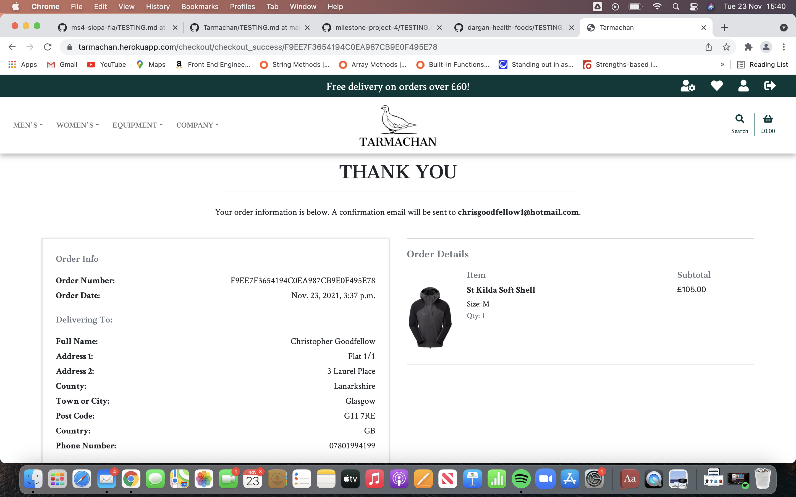

- Stripe Success: 

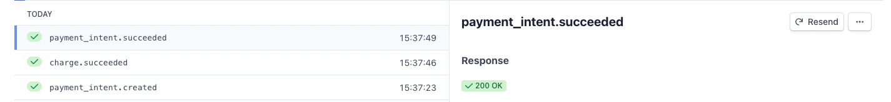

- Email Confirmation: 

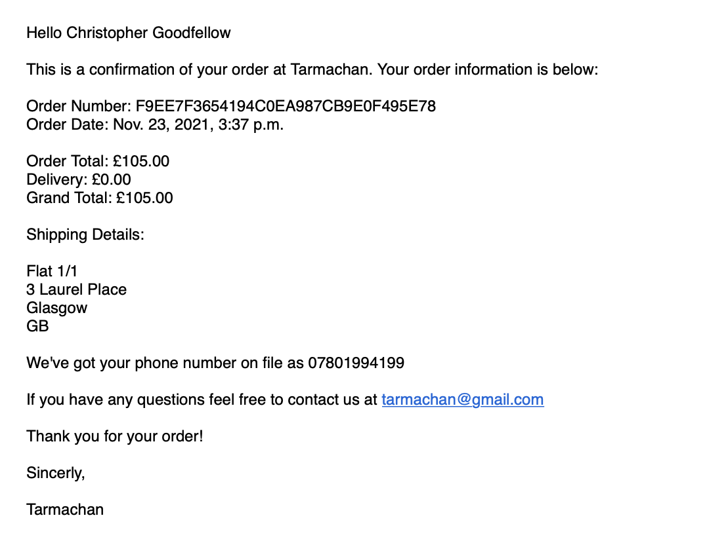

- Database Order:

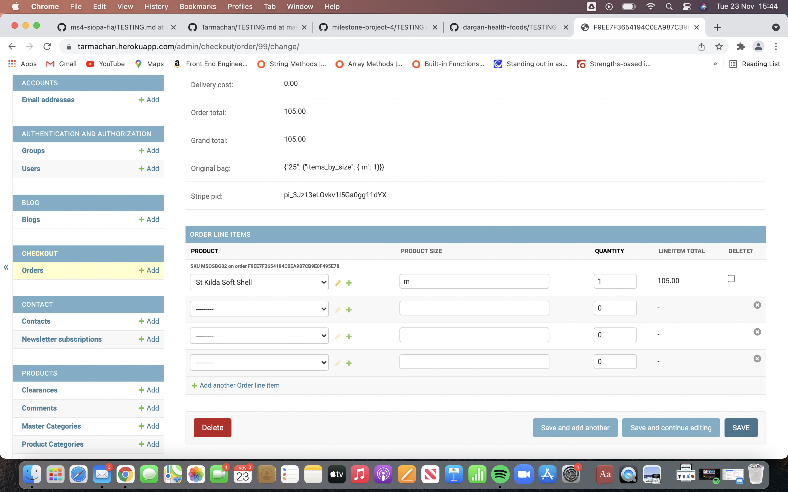

- Profile View: 

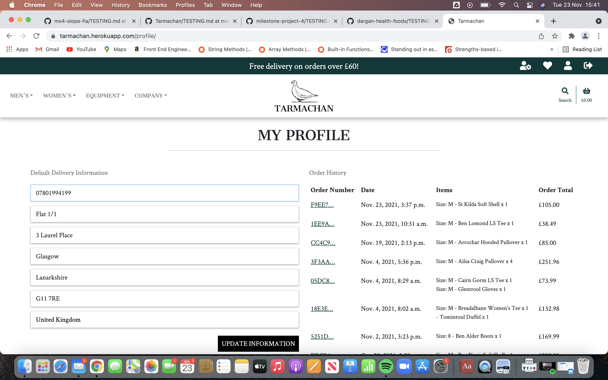

## Unregistered Users

- Confirmation Page:

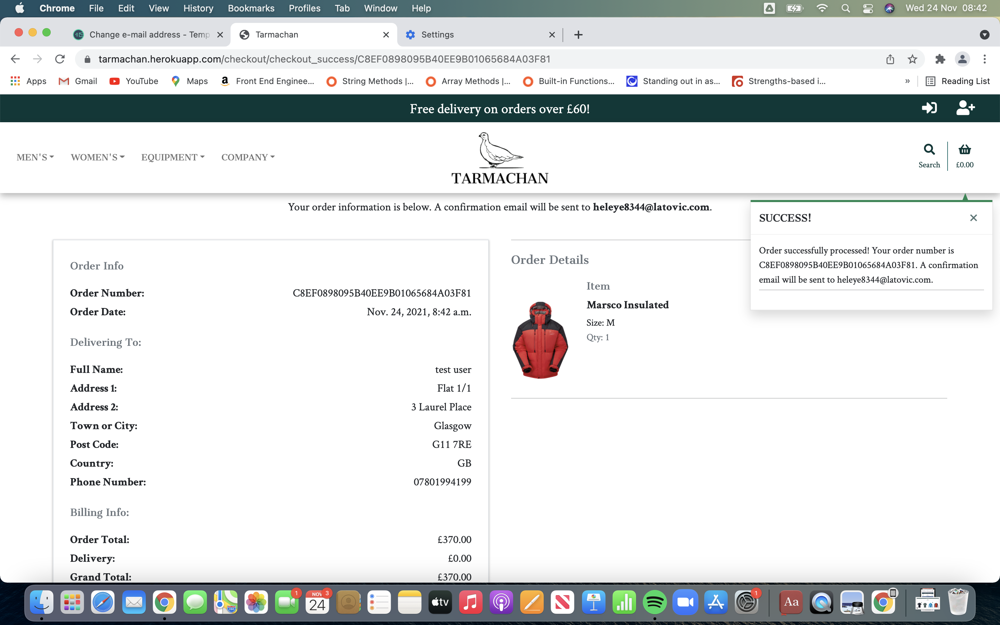

- Stripe Success: 

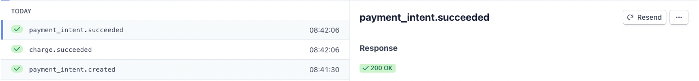

- Email Confirmation: 

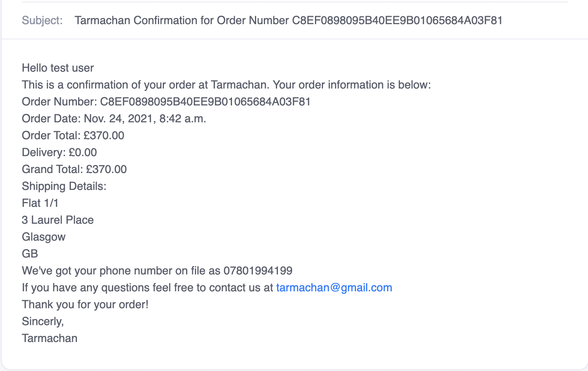

- Database Order:

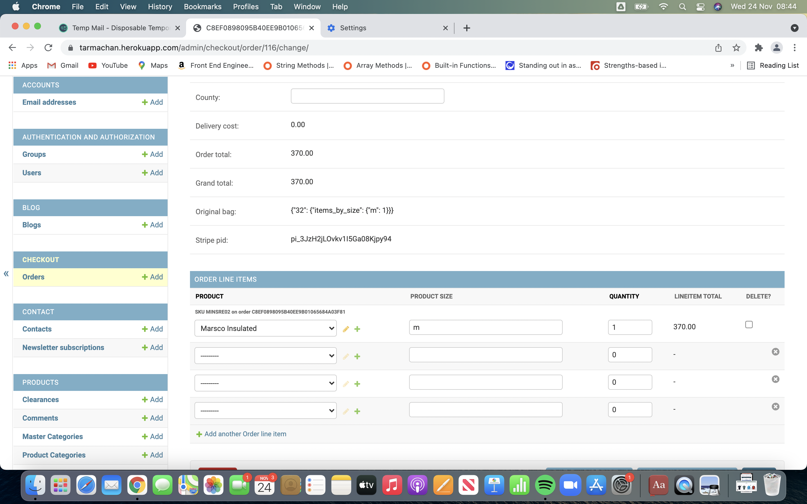

## Testing Card Errors

- Test Card with insufficient Funds:

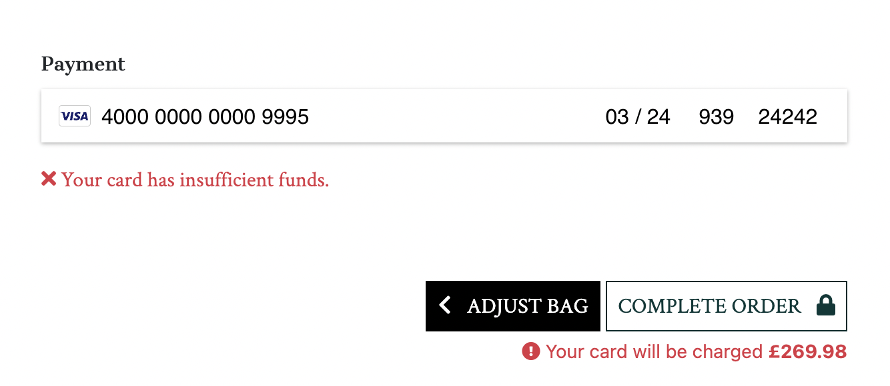

- Test Card that has expired:

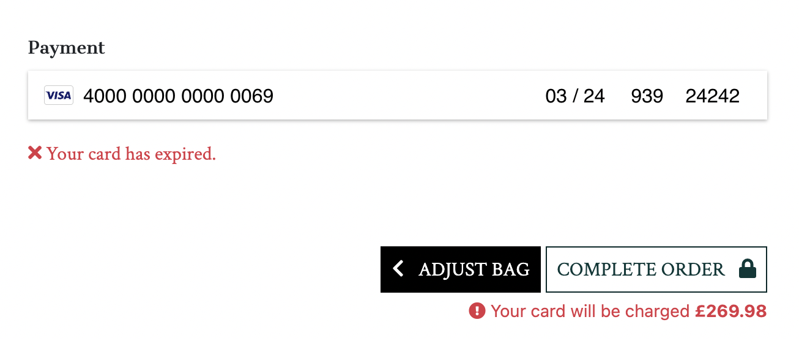

- Test Card with processing error: 

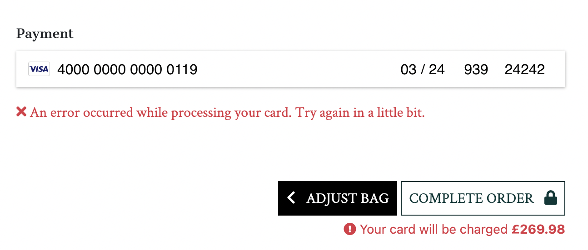

- Stripe Success with failed payments

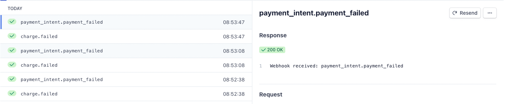


# Responsive 

Responsinator and Google Developer tools have been used to test responsiveness. These tools have been utilised throughout the development of the project.

Reponsinator examples can only show pages where a user is not logged in. 

Responsinator provides landscape and portrait views for: 

- Iphone X
- Android (Pixel 2)
- iPhone 6-8
- iPad

1. [Home Page](https://www.responsinator.com/?url=https%3A%2F%2Ftarmachan.herokuapp.com%2F)
2. [Products Page](http://www.responsinator.com/?url=tarmachan.herokuapp.com%2Fproducts%2F)
3. [Product Detail Page](http://www.responsinator.com/?url=http%3A%2F%2Ftarmachan.herokuapp.com%2Fproducts%2F16%2F)
4. [Shopping Bag Page](http://www.responsinator.com/?url=tarmachan.herokuapp.com%2Fbag%2F)
5. [About Us Page](http://www.responsinator.com/?url=http%3A%2F%2Ftarmachan.herokuapp.com%2Fabout_us%2F)
6. [Contact Us Page](http://www.responsinator.com/?url=http%3A%2F%2Ftarmachan.herokuapp.com%2Fcontact%2F)
7. [Blog Page](http://www.responsinator.com/?url=http%3A%2F%2Ftarmachan.herokuapp.com%2Fblog%2F)
8. [Blog Detail Page](http://www.responsinator.com/?url=http%3A%2F%2Ftarmachan.herokuapp.com%2Fblog%2F1%2F)
9. [Newsletter Unsubscribe Page](http://www.responsinator.com/?url=http%3A%2F%2Ftarmachan.herokuapp.com%2Fcontact%2Fnewsletter_unsubscribe%2F)
10. [Login Page](http://www.responsinator.com/?url=http%3A%2F%2Ftarmachan.herokuapp.com%2Faccounts%2Flogin%2F)
11. [Register Page](http://www.responsinator.com/?url=http%3A%2F%2Ftarmachan.herokuapp.com%2Faccounts%2Fsignup%2F)

Responsiveness has been manually tested on: 

- Iphone 8
- Ipad 8th Generation
- Macbook Air
- LG 22inch desktop monitor

The site has also been extensively tested for responsiveness on google developer tools. The smallest device tested was a Galaxy Fold device which the site works well on. 

### Note on Responsiveness

The website has been designed for optimize usage in portrait mode on smaller devices. Website still functions in landscape for mobile devices however the navbar takes up a lot of screen real estate. The website functions well in both portrait and landscape for tablets and larger. 

# Security Testing

## Defensive Programming

I have used a mixture of code and the "login_required" decorators to ensure that certain actions or pages cannot occur by typing URL's directly into the browser.

|  Test  |  User  |  Expected Result  |  Pass  |
|---|------| ---------------- |---|
| [Profile Page](https://tarmachan.herokuapp.com/profile/) | Non logged in user | Redirects the user back to the log in page | ✓ |
| [Wishlist](https://tarmachan.herokuapp.com/wishlist/) | Non logged in user | Error message to tell the user only site users have access to this feature | ✓ |
| [Add or Remove product to Wishlist](https://tarmachan.herokuapp.com/wishlist/add_to_wishlist/1) | Non logged in user | User gets redirected to the home page, and an error messages displays to tell the user only logged in users can add products to their wishlist | ✓ |
| [Site Management](https://tarmachan.herokuapp.com/product_management/) | Non logged in user | Redirects the user back to the log in page | ✓ |
| [Site Management](https://tarmachan.herokuapp.com/product_management/) | Logged in user | Redirects the user back to the home page and an error message displays to tell the user only Tarmachan team members have access to this page | ✓ |
| [Add Product](https://tarmachan.herokuapp.com/products/add/) | Non logged in user | Redirects the user back to the log in page | ✓ |
| [Add Product](https://tarmachan.herokuapp.com/products/add/) | Logged in user | Redirects the user back to the home page and an error message displays to tell the user only Tarmachan team members have access to this page | ✓ |
| [Add Blog](https://tarmachan.herokuapp.com/blog/add/) | Non logged in user | Redirects the user back to the log in page | ✓ |
| [Add Blog](https://tarmachan.herokuapp.com/blog/add/) | Logged in user | Redirects the user back to the home page and an error message displays to tell the user only Tarmachan team members have access to this page | ✓ |
| [Contact Management](https://tarmachan.herokuapp.com/contact_management/) | Non logged in user | Redirects the user back to the log in page | ✓ |
| [Contact Management](https://tarmachan.herokuapp.com/contact_management/) | Logged in user | Redirects the user back to the home page and an error message displays to tell the user only Tarmachan team members have access to this page | ✓ |
| [Contact Detail](https://tarmachan.herokuapp.com/contact_detail/7/) | Non logged in user | Redirects the user back to the log in page | ✓ |
| [Contact Detail](https://tarmachan.herokuapp.com/contact_detail/7/) | Logged in user | Redirects the user back to the home page and an error message displays to tell the user only Tarmachan team members have access to this page | ✓ |
| [Edit Product](https://tarmachan.herokuapp.com/products/edit/2) | Non logged in user | Redirects the user back to the log in page | ✓ |
| [Edit Product](https://tarmachan.herokuapp.com/products/edit/2) | Logged in user | Redirects the user back to the home page and an error message displays to tell the user only Tarmachan team members have access to this page | ✓ |
| [Edit Blog](https://tarmachan.herokuapp.com/blog/edit/1/) | Non logged in user | Redirects the user back to the log in page | ✓ |
| [Edit Blog](https://tarmachan.herokuapp.com/blog/edit/1/) | Logged in user | Redirects the user back to the home page and an error message displays to tell the user only Tarmachan team members have access to this page | ✓ |
| [Delete Product](https://tarmachan.herokuapp.com/products/delete/1) | Non logged in user | Redirects the user back to the log in page | ✓ |
| [Delete Product](https://tarmachan.herokuapp.com/products/delete/1) | Logged in user | Redirects the user back to the home page and an error message displays to tell the user only Tarmachan team members have access to this page | ✓ |
| [Delete Blog](https://tarmachan.herokuapp.com/blog/delete/7) | Non logged in user | Redirects the user back to the log in page | ✓ |
| [Delete Blog](https://tarmachan.herokuapp.com/blog/delete/7) | Logged in user | Redirects the user back to the home page and an error message displays to tell the user only Tarmachan team members have access to this page | ✓ |


## Passwords & Usernames

I have used Django all auth to handle user administration tasks: 
- This stores the users password as hashed key for security.
- Also ensures users are required to confirm their emails as an extra security step. 

I have done some testing to ensure that their can be no duplicate usernames or email address's: 
- Duplicate Username :

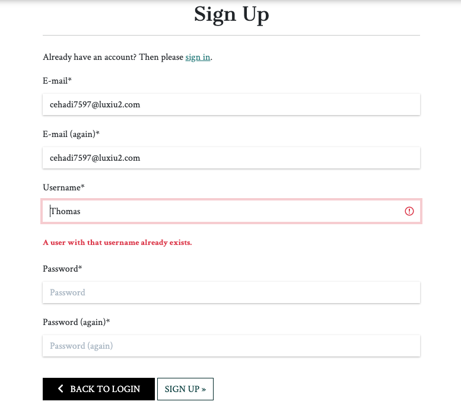

- Duplicate Email :

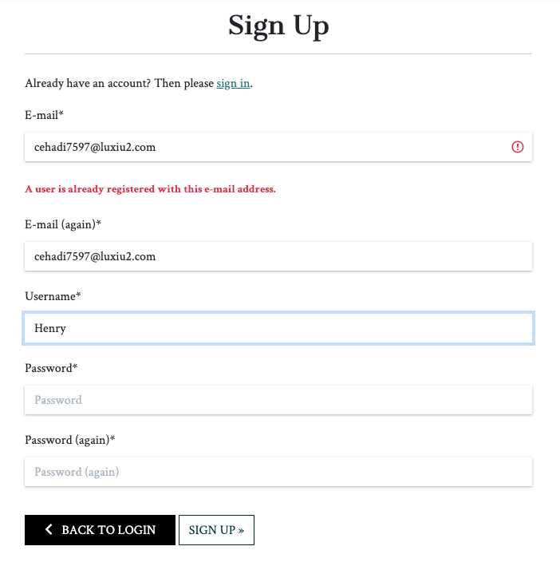

# Unit Testing

## Django Testing Framework

The site has been tested using the Django Testing framework which uses the TestCase class which is an extension of the Python standard library module called Unit Tests. Tests have been written to test the Models, Forms and the Views for each app.

To run the tests, in the terminal you can type the following command: 
- ```
    python3 manage.py test
  ```
A successful test will be indicated with a '.', and an unsuccessful test will result in an 'E' or 'F'. 

To show how much of the code has actually been tested I have used "Coverage".

To install coverage, in the terminal you can type the following command:
- ```
    pip3 install coverage
  ```

To run coverage for the whole site:
- ```
    coverage run --source=. manage.py test
  ```

To run coverage for individual apps:
- ```
    coverage run --source=<app name> manage.py test
  ```

To view the report in the terminal type the following command:
- ```
    coverage report
  ```

To create an interactive HTML report type the following command:
- ```
    coverage html
  ```
followed by 
- ```
    python3 -m http.server
  ```

## Test Coverage

|  App  |  Views  |  Models  |  Forms  |  Overall  |
|-------|------|-------|-------|-------|
| Bag | 29% | 100% | N/A | 53% |
| Blog | 79% | 100% | 100% | 94% |
| Checkout | 47% | 96% | 100% | 64% |
| Contact | 98% | 100% | 100% | 99% |
| Home | 100% | 100% | N/A | 100% |
| Products | 92% | 100% | 100% | 98% |
| Profiles | 100% | 100% | 100% | 100% |
| Wishlist | 100% | 100% | N/A | 100% |
| Tarmachan | N/A | N/A | N/A | 87% |

### Review

For the purposes of this site I am reasonably happy with the tests that have been written and percentage of the app that is covered by tests. Given this is the first time I have written unit tests I am happy to accept that 87% of the site is covered by tests. I would certainly like to revisit tests for the bag and checkout app in particular to try and increase the percentage of the app covered by tests to as close to 100% as possible. 


# Solved Bugs

|  #  |  Bug  |  Description  |  Fix  |
|:---:|------| ---------------- |----------------|
| 01 | Deleting products on prodcut page | When trying to delete a product on the products page. When I opened to modal to delete a product it wouldn't retrieve the correct product ID in order to delete it. It was only the first product that would get deleted. | I tried to move the delete modal inside the for loop within the template, however this did not resolve the issue. I found a solution on stack overflow which grabbed the data id and url and applied them to the correctly to the delete modal with some javadscript. |
| 02 | Parallax Container on smaller devices | I originally found the css code for creating a parallax image on w3schools. However when testing the device on smaller devices (ipad and iphone) the parallax image was zoomed in and not was not in a fixed position as it is on desktop devices. | After some research I found the issue was stemming from the "background-attachment: fixed;" property. This does not appear to be compatible on IOS devices. I found a solution on stack overflow which was to set the background image for the whole page and give it a lower z-index, so that the parallax image only appears in the parallax container, and then set the remaining page background to white.  |
| 03 | Product review form on smaller devices | The product review form was not rendering correctly on mobile devices. It worked as expected on desktop devices however there wouldn't be a box for the subject and comment fields. | As there is no context for the add comment view I was unable to render the form as a crispy field, which i believe was where the issue was stemming from. Having looked on dev tools at the classes applied to crispy fields I could see there was a few classes missing from the fields for the review fields. After adding these to the subject and comment inputs the form was rendering as expected on all fields. |
| 04 | Quantity Selectors | When I refactored the shopping bag page so that on smaller devices rather than a table displaying (which would require side scrolling), it displayed a grid, there was an issue with the quantity selectors on larger devices. This is because the quantity form is used twice, and hides either the table or the grid depending on screen size. However as the quantity form uses an ID to identify itself, only the first element within the HTML with that ID is picked up. | To combat this problem i have made changes to the quantity input script. I have put a check in place to see if the quantity is more than 2, to allow for decremental functionality. Simarlarly I have put a check in place to see if the quantity is less then 99, to allow for incremental functionality.  |
| 05 | Blog Cards first paragraph | When creating the cards for each blog on the blogs page I had some styling issues. As I have included the first paragraph on the blog cards, this meant that each card could be vastly different in height due to the length of paragraph 1 and make the overall appearance of the page look messy and disjointed.  | In order to fix this I added a line-clamp class to each of the cards for this paragraph. This meant that only the first 3 lines would be displayed with a '...' at the end. This made the cards more uniform and gave the site a better appearance. |
| 06 | Bug in testing file | I had problems with my gitpod workspace where I was unable to save any of the changes I was making to the TESTING.md file. It was essentially crashing the workspace as I could not open any additional files | I think this was stemming from trying to render the gifs for the user stories. I created a new testing files and created links to the user stories gifs rather than rendering them. The workspace no longers breaks when making changes |
| 07 | 500 server error on checkout success page | When testing purchasing on iphone and ipad I was getting a 500 server error. The error was showing on Stripe as "Webhook received: payment_intent.succeeded | ERROR: value too long for type character varying(2)" | After some research I initially thought the error was stemming from the country field due to the character value too long being 2. However after discussing this with tutor support they advised that the site was running on an old version and that by clearing the cache and history this will bring the site up to date | There have been no more errors like this since |
| 08 | Console error for products without sizes | When on the products pages for products which did not have sizes, and more specifically items which do not have a sizing chart, I was getting a "Uncaught TypeError: Cannot read properties of null". | This was affecting the performance of the site on lighthouse. The error was stemming from the javascript for opening and closing the sizing charts. By checking firstly to see if their was a sizing chart before adding event listeners this has resolved the error in the console. (e.g: if (open_btn) { "event listener here" }|


# Known Issues
|  #  |  Bug  |  Description  | Example |
|:---:|------| ---------------- | --------- |
| 01 | Scrolling with Parallax Images | After implementing the fix with parallax images for IOS devices, there is an issue on IOS devices due to IOS bounce effects, so when a user scrolls past the top or bottom of the page the parallax image is revealed before the site snaps back. I have added "overscroll-behavior: none;" to the html and body elements, and this works for chrome and desktop devices, but doesn't work for ipad / iphone. I have tried implementing different solutions but none seem to get the desired effect without disabling scrolling on the entire page. I am happy to accept this as a small drawback to the parallax images. | [View](documentation/testing/known_issues/parallax.gif) |
| 02 | Sorting by product price with clearance prices | When sorting products by price either high to low or low to high it doesnt take into account the product which has clearance prices on them. It will only sort the product by their original price, and is therefore not giving a true representation. I am happy to accept this as a known limitation. | [View](documentation/testing/known_issues/product_sorting.gif) |
| 03 | Duplicate ID's for email DIV's | On the contact page, unsubscribe page and checkout page I am getting a duplicate ID error, when checking the HTML files, as a result of crispy forms being rendered. This is due to "email" field being used in all the models and the newsletter form being available on all pages. I have tried to update the div ID using crispy-forms FormHelper class, but I'm unable change the div id. After consulting with tutor support I agreed to leave this as a known issue, as changing the models, forms, views, tests etc could lead to more issues at this stage of the project. | [View](documentation/testing/code_validation/html/checkout_html.png)| 

# Lighthouse

The website's performance has been tested using Google Lighthouse

|  Page  |  Performance  |  Accessibility  | Best Practices | SEO | Comments |
|----|----|----|----|----|-----------|
| Home | 77 | 92 | 100 | 100 | To improve Accessibility: "Buttons do not have a discernible name". These are being rendered by the owl carousel for the dots to change slides, therefore cannot change. To improve Performance: Re-size images - For the purposes of this site I'm happy to accept this as a limitation, as I do not want to reduce the image quality any further than they already have been. |
| Products | 61 | 100 | 100 | 90 | To Improve performance: Suggestions to serve images in next gen formats. As I require a transparent background for the product detail page of the products images, the images need to be served as png. Performance greatly improves when there are less products displayed, and as most users will want to display cetain catgeories of products this will improve the performance of this page. A future fix to this could be to paginate the page so only a limited number of products appear per page. Happy to accept this as a know limitation for the purposes of this project. To improve SEO: Links are not crawlable. The delete product link in the delete modal does not have an 'href' attribute directly in the html, but this is populated by javascript and is therefore a known limitation. |
| Product Detail | 82 | 92 | 100 | 90 | To Improve performance: Serve images in next gen formats (not applicable for this site as previously discussed). To Improve Accessibility: Form elements do not have associated labels - This is for the quantity selector and is not needed. To improve SEO: Links are not crawlable - href pulled by javascript as previously discussed. |
| Shopping Bag | 95 | 90 | 100 | 100 | To improve accessibility: "id" attributes on focusable element are not unique - justified use as elements with the same ID are hidden on different devices sizes | 
| Checkout | 99 | 94 | 100 | 100 | N/A |
| Checkout Success | 99 | 98 | 100 | 100 | N/A |
| About Us | 96 | 100 | 100 | 100 | N/A |
| Contact | 99 | 97 | 100 | 100 | N/A |
| Blog | 88 | 99 | 100 | 100 | To improve Performance: Re-size images - For the purposes of this site I'm happy to accept this as a limitation, as I do not want to reduce the image quality any further than they already have been. |
| Blog Detail | 97 | 100 | 100 | 100 | N/A |
| Wishlist | 97 | 100 | 100 | 100 | N/A |
| Profile | 98 | 100 | 100 | 100 | N/A |
| Site Management | 97 | 100 | 100 | 100 | N/A |
| Add Product | 99 | 92 | 100 | 100 | To improve accessibility: Heading elements not in a sequential order. Not needed for aesthetics of the site. |
| Add Blog | 99 | 92 | 100 | 100 | To improve accessibility: Heading elements not in a sequential order. Not needed for aesthetics of the site. |
| Contact Management | 99 | 98 | 100 | 90 | To improve SEO: Links are not crawlable. The delete contact link in the delete modal does not have an 'href' attribute directly in the html, but this is populated by javascript and is therefore a known limitation.  |
| Contact Detail | 98 | 99 | 100 | 100 | N/A |
| Edit Product | 97 | 92 | 100 | 100 | N/A |
| Edit Blog | 98 | 92 | 100 | 100 | N/A |
| Log Out | 99 | 100 | 100 | 100 | N/A |
| Sign In | 100 | 100 | 100 | 100 | N/A |
| Sign Up | 98 | 93 | 100 | 100 | N/A |